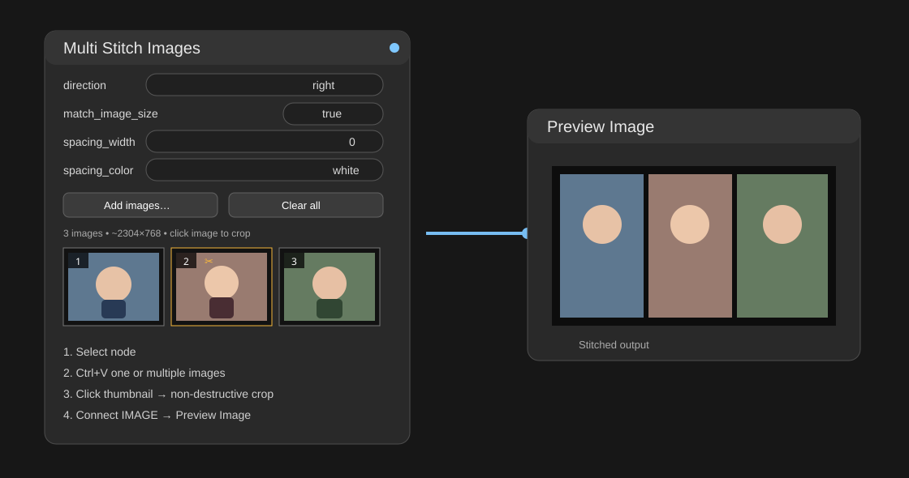
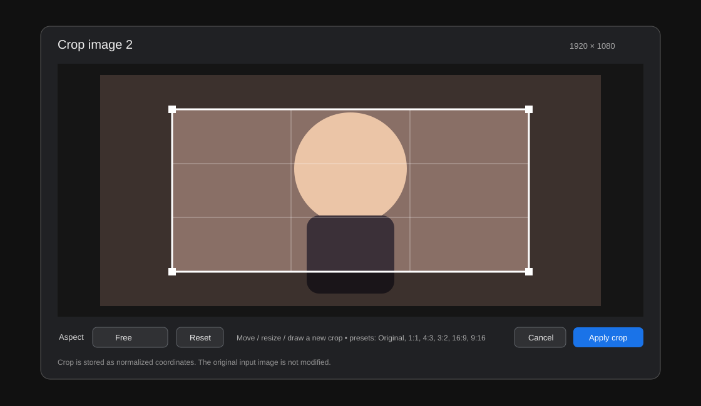

# Comfyui-Image-Stitch

**Multi Stitch Images** for ComfyUI — paste many images into one node, crop/rotate/flip each image, drag thumbnails to reorder them, then output either a classic stitched strip or a configurable grid.

> 한국어 설명이 먼저 나오고, The English documentation follows below.



## 🇰🇷 한국어

### 핵심 기능

- **Ctrl+V 다중 이미지 붙여넣기**: 노드를 선택한 상태에서 붙여넣으면 이미지가 한 노드 안에 순서대로 추가됩니다.
- **썸네일 Drag Reorder**: 이미지를 잡아서 원하는 위치로 드래그하면 순서가 바뀝니다. `‹ / ›` 버튼도 보조 수단으로 유지합니다.
- **이미지별 편집기**: 썸네일을 클릭하면 Crop + Rotate + Flip 편집기가 열립니다.
- **비파괴 편집**: 원본 파일을 다시 저장하지 않고 workflow에는 Crop/회전/반전 상태만 저장합니다.
- **Strip / Grid 모드**
  - `strip`: 기존 Stitch Images처럼 한 줄/한 열로 연결
  - `grid`: 2열, 3열, 4열 등 `grid_columns`로 자동 배치
- **Stitch Images 계열 옵션 유지**
  - `direction`: `right / down / left / up`
  - `match_image_size`
  - `spacing_width`
  - `spacing_color`
- **Custom spacing color**: `spacing_color = custom` 선택 후 노드의 `Custom color: #RRGGBB` 버튼으로 원하는 색을 고를 수 있습니다.
- **예상 최종 해상도**를 노드 내부에 표시합니다.
- 결과는 일반 `IMAGE` 출력이므로 **Preview Image / Save Image / VAE Encode** 등에 바로 연결할 수 있습니다.
- 백엔드 안전 제한: 노드당 최대 256장.

### 이미지 편집기



썸네일을 클릭하면 다음 편집 기능을 사용할 수 있습니다.

- Crop 박스 내부 드래그 → 위치 이동
- 네 모서리 드래그 → Crop 크기 조절
- Crop 바깥에서 드래그 → 새 Crop 영역 지정
- 비율 프리셋: `Free / Original / 1:1 / 4:3 / 3:2 / 16:9 / 9:16`
- `↶ 90° / ↷ 90°`
- `Flip H / Flip V`
- `Reset crop`
- `Reset all`

회전/반전을 누르면 새 방향을 기준으로 다시 Crop 하기 쉽도록 Crop 영역은 전체 이미지로 초기화됩니다.

### 설치

ComfyUI의 `custom_nodes` 폴더에서:

```bash
git clone https://github.com/ssain3d-lgtm/Comfyui-Image-Stitch.git
```

이미 설치했다면:

```bash
cd Comfyui-Image-Stitch
git pull
```

그 다음 ComfyUI를 재시작합니다. 별도 Python 패키지는 필요하지 않습니다.

### 기본 사용법

1. `image/transform`에서 **Multi Stitch Images** 노드를 추가합니다.
2. 노드를 한 번 클릭해 선택합니다.
3. Windows 탐색기/브라우저/이미지 편집기에서 이미지를 복사하고 **Ctrl+V** 합니다.
4. 썸네일을 **드래그해서 순서 변경**합니다.
5. 썸네일을 **클릭**해 Crop / Rotate / Flip을 적용합니다.
6. `layout_mode`를 선택합니다.
   - `strip`: 기존 Stitch 방식
   - `grid`: 여러 줄 Grid
7. Grid라면 `grid_columns`를 2, 3, 4 등으로 지정합니다.
8. `direction`, `match_image_size`, `spacing_width`, `spacing_color`를 설정합니다.
9. 사용자 색상이 필요하면 `spacing_color = custom` → `Custom color: #...` 버튼을 누릅니다.
10. `IMAGE` → **Preview Image**로 연결하고 Queue를 실행합니다.

### Drag Reorder

노드 안의 썸네일 중앙을 누른 뒤 다른 썸네일 위치로 드래그합니다.

- 짧게 클릭 → 이미지 편집기 열기
- 일정 거리 이상 드래그 → 순서 변경 모드
- 드래그 중 이동 대상 썸네일이 파란 테두리로 표시
- `‹ / ›` 버튼은 한 칸씩 이동하는 보조 방식

### Grid 모드

`layout_mode = grid`일 때 `grid_columns`가 최대 열 수가 됩니다.

예:

```text
grid_columns = 3

1  2  3
4  5  6
7  8
```

실제 이미지 수가 열 수보다 적으면 불필요한 빈 열을 만들지 않습니다.

Grid에서도 `direction`을 사용합니다.

- `right`: 좌 → 우, 위 → 아래
- `left`: 우 → 좌, 위 → 아래
- `down`: 위 → 아래, 좌 → 우
- `up`: 아래 → 위, 좌 → 우

#### Grid + `match_image_size`

- `true`: 첫 번째 이미지의 Crop 결과 크기를 셀 기준으로 사용하고, 나머지 이미지는 **종횡비를 유지한 채 셀 안에 Fit**합니다.
- `false`: 가장 큰 이미지 크기를 셀 기준으로 사용하고 각 이미지를 중앙 정렬합니다.

### Custom spacing color

기본 색상:

`white / black / red / green / blue / custom`

`custom` 선택 후 `Custom color: #808080` 버튼을 누르면 브라우저 색상 선택기가 열립니다.

Strip과 Grid 모두 동일하게 적용되며, Grid에서는 이미지 사이 간격과 셀 여백 배경에도 같은 색이 사용됩니다.

### 붙여넣기 동작

최신 ComfyUI의 이미지 paste routing을 이용합니다. 이 노드는 `previewMediaType = "image"`와 `pasteFiles()`를 제공하므로 별도의 전역 Ctrl+V 가로채기를 최소화합니다.

붙여넣거나 추가한 이미지는 다음 폴더에 저장됩니다.

```text
ComfyUI/input/multi_stitch/
```

Workflow에는 이미지 참조와 다음 편집 상태가 저장됩니다.

- Crop 좌표
- Rotation
- Horizontal / Vertical Flip
- 이미지 순서

따라서 workflow를 다른 PC로 옮길 때는 참조된 입력 이미지도 같이 옮겨야 합니다.

---

## 🇺🇸 English

### Features

- **Paste multiple images with Ctrl+V** into a selected `Multi Stitch Images` node.
- **Drag thumbnails to reorder**; `‹ / ›` remain available for one-step moves.
- **Per-image editor** with Crop, Rotate 90°, Flip H, and Flip V.
- **Non-destructive editing**: source images are not re-encoded when you edit them.
- **Strip mode** compatible with the familiar Stitch Images interaction model.
- **Grid mode** with configurable `grid_columns`.
- `direction`: `right / down / left / up`.
- `match_image_size`, `spacing_width`, and `spacing_color`.
- **Custom spacing color** with a native color picker.
- Estimated final output resolution shown inside the node.
- Standard `IMAGE` output for `Preview Image`, `Save Image`, `VAE Encode`, etc.
- Safety limit: 256 images per node.

### Installation

From your ComfyUI `custom_nodes` directory:

```bash
git clone https://github.com/ssain3d-lgtm/Comfyui-Image-Stitch.git
```

To update:

```bash
cd Comfyui-Image-Stitch
git pull
```

Restart ComfyUI. No extra Python packages are required.

### Usage

1. Add **Multi Stitch Images** from `image/transform`.
2. Select the node.
3. Copy one or more images/files and press **Ctrl+V**.
4. Drag thumbnails to reorder them.
5. Click a thumbnail to Crop / Rotate / Flip it.
6. Choose `layout_mode = strip` or `grid`.
7. For Grid, set `grid_columns`.
8. Set direction, size matching, spacing width, and spacing color.
9. For an arbitrary gap color, choose `spacing_color = custom` and click the `Custom color` button.
10. Connect `IMAGE` to **Preview Image** and queue the workflow.

### Per-image editor

- Drag inside the crop rectangle to move it.
- Drag a corner to resize it.
- Drag outside to create a new crop.
- Aspect presets: `Free / Original / 1:1 / 4:3 / 3:2 / 16:9 / 9:16`.
- Rotate left/right by 90°.
- Flip horizontally or vertically.
- `Reset crop` restores the full currently transformed image.
- `Reset all` removes rotation/flips and restores the full image.

Changing rotation or flip resets the crop to the full transformed image so the next crop is always visually predictable.

### Grid behavior

`grid_columns` is the maximum number of columns. If fewer images are present, the node does not create unnecessary empty columns.

Direction controls the Grid fill flow:

- `right`: left-to-right, then top-to-bottom
- `left`: right-to-left, then top-to-bottom
- `down`: top-to-bottom, then left-to-right
- `up`: bottom-to-top, then left-to-right

With `match_image_size = true`, the first edited image defines the cell size and the other images are fit into that cell while preserving aspect ratio. With it disabled, the largest edited image defines the cell size.

### Design notes

The node intentionally keeps pasted images **inside one visual node** instead of creating an ever-growing list of IMAGE sockets. The frontend manages paste/drop, thumbnails, drag reorder, editing, and workflow state. The backend applies transform → crop → optional resize → Strip/Grid composition at execution time.

## Compatibility

- Designed for current ComfyUI legacy-canvas/custom-node APIs and native clipboard routing (`previewMediaType` + `pasteFiles`).
- Uses only dependencies normally shipped with ComfyUI: PyTorch, Pillow, NumPy.
- No ComfyUI core files are modified.

## Credits

The control names and classic strip behavior intentionally follow ComfyUI's built-in **Stitch Images** node, which was upstreamed from **Kijai's ComfyUI-KJNodes**. This project adds multi-image paste, editing, reordering, custom colors, and Grid composition around that model.

## License

MIT
