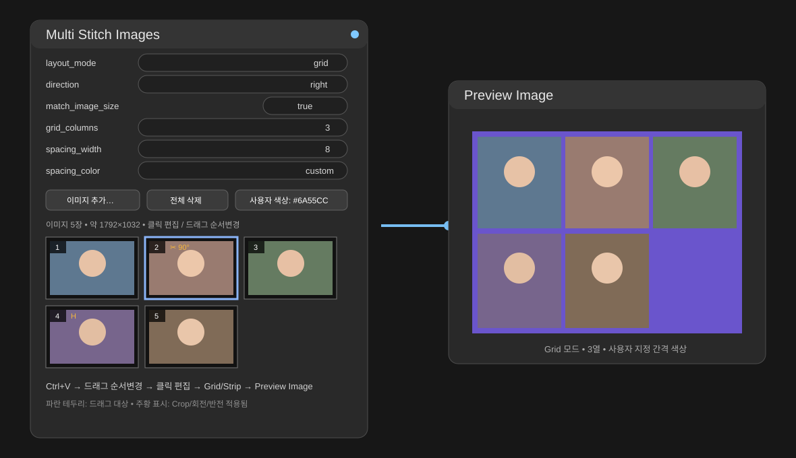
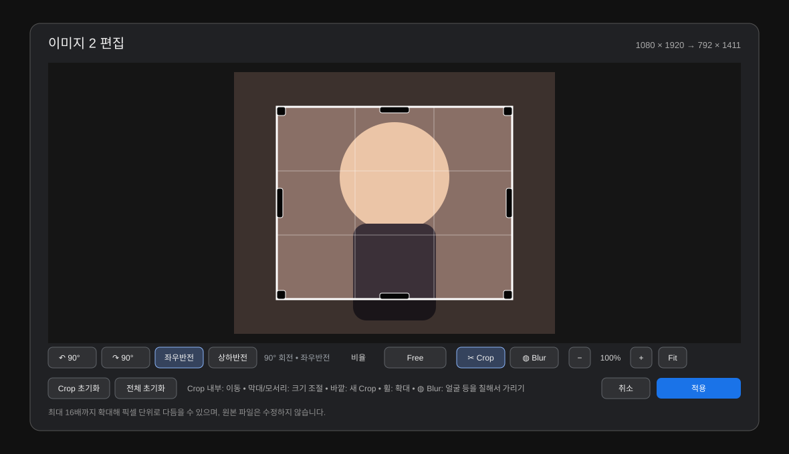
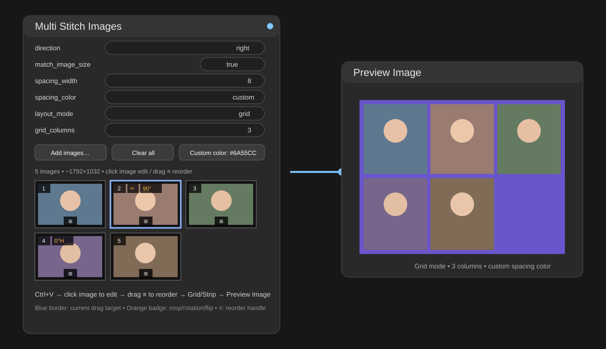
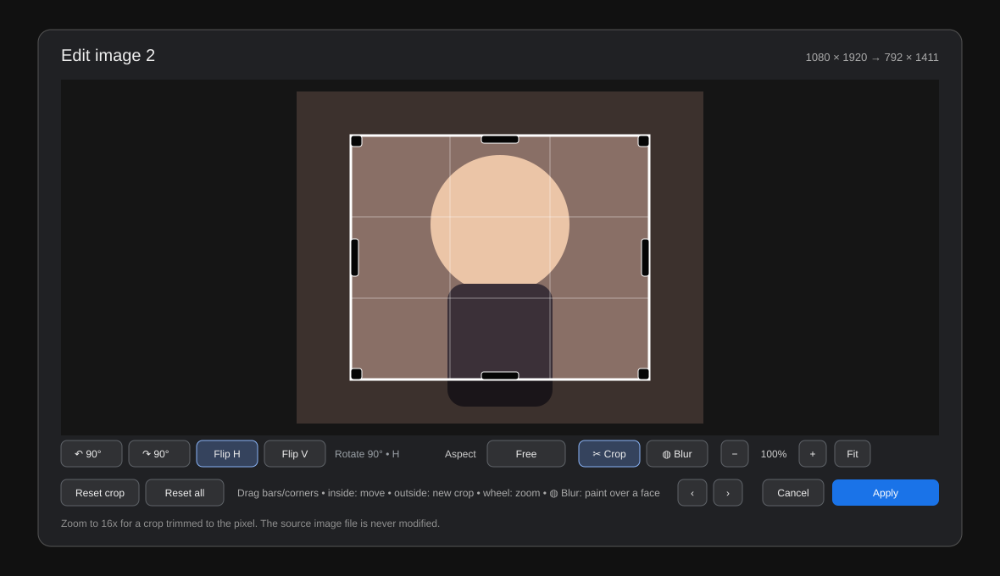

# Comfyui-Image-Stitch

**Multi Stitch Images** for ComfyUI — paste many images into one node, crop / rotate / flip each image, click an image to edit it, drag its dedicated `≡` handle to reorder, then output a classic stitched strip or a configurable grid.

**[한국어](#-한국어) · [English](#-english)**

---

# 🇰🇷 한국어

## 소개

`Multi Stitch Images`는 여러 이미지를 한 노드에 바로 붙여 넣고 편집한 뒤 하나의 `IMAGE`로 합치는 ComfyUI 커스텀 노드입니다.

- **Ctrl+V 다중 이미지 붙여넣기**
- 이미지 클릭 → **즉시 Edit**
- 전용 **`≡` Drag Handle**로 이미지 순서 변경
- 썸네일 **우클릭 → 원본 이미지 클립보드 복사**
- **`⧉ Copy` 버튼 → 합성 결과를 Queue 없이 바로 클립보드 복사**
- **동영상에서 장면 캡처** — 프레임 단위로 찾아 원본 해상도 PNG로 목록에 추가, 동영상은 저장 공간을 차지하지 않음
- 툴바 한 줄 `+ Add · Clear · ⧉ Copy · ↶ ↷ · Preview · Options` — 고급 옵션은 **접혀 있고** 기본값이 아닌 것만 표시
- 이미지별 **Crop / 90° Rotate / Flip H / Flip V**
- Free Crop용 **상/하/좌/우 + 모서리 핸들**
- **Strip / Grid** 레이아웃
- `direction`: `right / down / left / up`
- `match_image_size`
- `spacing_width`
- 기본색 + **Custom spacing color**
- 노드 내부 **예상 최종 해상도 표시**
- 노드 내부 **최종 합성 미리보기** (Queue 전에 실제 배치 확인)
- 출력 크기 옵션: **`output_limit`**, Grid **셀 크기 고정**
- 선택 **IMAGE 입력** 연결 + 개별 **`cells`** 출력
- **↶ / ↷ 실행 취소·다시 실행**
- 이미지 수에 맞춰 **아래로 늘어나는 목록** (스크롤 없음)
- 파일이 사라진 이미지 **재연결** (Crop·순서 유지)
- 초대형 결과 생성 전 **Output Size Safety Guard**
- 일반 `IMAGE` 출력 → `Preview Image`, `Save Image`, `VAE Encode` 등에 바로 연결
- 추가 Python 패키지 불필요

### 1.2에서 달라진 점

- **툴바 한 줄** `+ Add · Clear · ⧉ Copy · ↶ ↷ · Preview · Options`와 **접히는 고급 옵션** — 기본 상태 위젯 10행 → 5행. 기본값이 아닌 옵션은 접혀 있어도 보입니다.
- **`⧉ Copy`** — 합성 결과를 Queue 없이 브라우저에서 만들어 클립보드에 넣습니다.
- **`match_image_size` 기본값이 `true`** — 새 노드는 처음부터 이미지 높이(세로 Strip은 너비)를 맞춰 붙입니다. 저장된 워크플로우는 자기 값을 유지합니다.
- **`match_reference`** — `match_image_size`의 기준을 첫 번째 / 가장 큰 / 가장 작은 이미지 중에서 고릅니다(`Options ▸` 안). 기본값 `smallest`는 순서를 바꾸지 않아도 확대 없이 높이를 맞춥니다. 이 옵션이 생기기 전에 저장한 워크플로우는 예전 동작인 `first`로 열립니다.
- **동영상에서 장면 캡처** — 동영상을 넣으면 프레임 선택기가 열리고, 캡처한 프레임은 보통 이미지처럼 편집·합성됩니다. 동영상은 temp 폴더에만 잠시 있다가 캡처가 끝나면 지워집니다.
- 모든 위젯과 출력에 **툴팁** — 마우스를 올리면 설명이 보입니다.
- **한국어 UI** — ComfyUI 언어를 한국어로 두면 위젯 이름·선택지·툴팁·노드 설명이 한국어로 표시됩니다.
- **예제 워크플로우** 2개 — 템플릿 브라우저의 `Comfyui-Image-Stitch` 항목(붙여넣기 → Strip, IMAGE 배치 → Grid + cells).
- 전체 이력은 [CHANGELOG.md](CHANGELOG.md)에 있습니다.

### 1.1에서 달라진 점

- 새 노드는 **원본 크기 유지**가 기본이었습니다: `match_image_size = false`, `output_limit = none` (1.2에서 `match_image_size` 기본값은 다시 `true`가 되었고, `output_limit = none`은 그대로입니다). 저장된 워크플로우는 자기 설정을 그대로 유지하고 출력 연결도 바뀌지 않습니다.
- `cells` 출력에 **`cells_resolution = source`** 가 추가되어 개별 이미지를 축소 없이 원본 크기로 받을 수 있습니다.
- **`minimum_image_side`** — 배치된 이미지의 짧은 변이 지정값보다 작아지면 디코딩 전에 실행을 중단합니다(기본 0 = 끄기).
- 참조 파일이 바뀌면(크기·수정 시각) 노드가 **자동으로 다시 실행**됩니다.
- 썸네일 원본 디코딩을 **동시에 2개**로 제한하고, PNG 끝에 붙은 EXIF도 디코딩 없이 읽습니다.

> 아래 한국어 이미지는 이해를 돕기 위해 일부 버튼/설명을 번역한 가이드 이미지입니다. 실제 노드의 옵션 이름은 ComfyUI 언어 설정에 따라 영문 또는 한국어로 표시됩니다.

## 전체 사용 예시



## 설치 — Step by Step

### 방법 A — Git 설치 권장

**1. ComfyUI를 종료합니다.**

**2. ComfyUI의 `custom_nodes` 폴더를 엽니다.**

```text
ComfyUI/custom_nodes/
```

**3. 해당 폴더에서 터미널 / CMD / PowerShell을 엽니다.**

**4. 아래 명령을 실행합니다.**

```bash
git clone https://github.com/ssain3d-lgtm/Comfyui-Image-Stitch.git
```

**5. ComfyUI를 다시 실행합니다.**

**6. 노드 검색에서 `Multi Stitch Images`를 찾습니다.**

```text
image/transform → Multi Stitch Images
```

끝입니다. `pip install`은 필요하지 않습니다.

### 방법 B — ZIP 설치

1. GitHub에서 **Code → Download ZIP**
2. 압축 해제
3. 폴더를 `ComfyUI/custom_nodes/Comfyui-Image-Stitch/`에 넣기
4. ComfyUI 재시작

> 폴더가 `Comfyui-Image-Stitch/Comfyui-Image-Stitch/...`처럼 이중으로 들어가지 않게 확인하세요.

### 방법 C — ComfyUI Manager

Comfy Registry에 게시된 뒤에는 ComfyUI Manager의 **Custom Nodes Manager**에서 `Multi Stitch Images`를 검색해 설치할 수 있습니다.

## 업데이트

이미 설치되어 있다면:

```bash
cd Comfyui-Image-Stitch
git pull
```

그 다음 ComfyUI를 완전히 재시작하고, 프론트엔드 변경이 보이지 않으면 브라우저에서 `Ctrl+F5`를 한 번 실행하세요.

## 사용법 — Step by Step

1. **`Multi Stitch Images` 노드를 추가**합니다.
2. 노드를 한 번 클릭해 **선택**합니다.
3. 이미지 파일/브라우저 이미지/스크린샷을 복사한 뒤 **Ctrl+V** 합니다.
   - 파일로 추가하려면 툴바의 **`+ Add`**(또는 비어 있는 점선 상자 클릭)를 씁니다. 업로드 중에는 노드 제목에 진행률(`uploading 2/5…`)이 표시되고 `+ Add`가 **`Cancel 2/5`**로 바뀝니다. 취소하면 이미 올라간 이미지는 남고 나머지만 중단됩니다. 업로드 중 `Clear`는 업로드까지 함께 취소합니다.
   - 한 노드에 최대 **256장**입니다. 넘치는 파일은 업로드 전에 건너뛰고 알려줍니다.
   - 썸네일은 긴 변 **512px**로 축소한 사본만 유지하므로 고해상도 이미지를 많이 넣어도 브라우저 메모리가 원본 크기만큼 늘지 않습니다. 편집기와 실제 합성은 항상 원본을 사용합니다.
4. 편집할 이미지는 **썸네일 이미지 영역을 한 번 클릭**합니다.
5. 순서를 바꾸려면 썸네일 하단 중앙의 **`≡` 핸들만 잡고 드래그**합니다.
   - 썸네일을 **우클릭**하면 `Copy original image #N` 메뉴가 나옵니다. 클릭하면 **편집 전 원본 이미지 전체**가 클립보드에 복사됩니다.
   - 툴바의 **`⧉ Copy`** 버튼(또는 우클릭 → `Copy stitched result`)은 지금 설정대로 **합성된 결과**를 원본 해상도로 브라우저에서 만들어 PNG로 클립보드에 넣습니다 — Queue를 돌리지 않아도 됩니다.
6. `layout_mode`를 선택합니다.
   - `strip` → 기존 Stitch Images처럼 한 줄/한 열로 연결
   - `grid` → 여러 행/열로 자동 배치
7. `direction`, `match_image_size`, `spacing_width`, `spacing_color`를 설정합니다.
8. Grid라면 `grid_columns`를 지정합니다.
9. 원하는 색이 필요하면 `spacing_color = custom` 후 **`Custom color: …`** 버튼을 사용합니다.
10. `IMAGE` 출력을 **Preview Image**에 연결하고 Queue를 실행합니다.
11. 썸네일 위 **미리보기 띠**에서 배치를 확인합니다. 결과 전체 크기를 제한하려면 `output_limit`, Grid 셀 크기를 고정하려면 `grid_cell_width / height`를 설정합니다.
12. 생성·업스케일 결과를 바로 붙이려면 `images` 입력에 IMAGE를 연결합니다. 개별 이미지가 필요하면 `output_cells`를 켜고 `cells` 출력을 씁니다.

## 이미지 편집기



썸네일 이미지 영역을 한 번 클릭하면 이미지별 편집기가 열립니다.

- Crop 내부 드래그 → 영역 이동
- **상/하/좌/우 검정 막대 핸들** → 해당 변만 조절
- **모서리 검정 핸들** → 가로/세로 동시 조절
- Crop 바깥 드래그 → 새 Crop 영역 생성
- 비율 프리셋: `Free / Original / 1:1 / 4:3 / 3:2 / 16:9 / 9:16`
- `↶ 90° / ↷ 90°`
- `Flip H / Flip V`
- `Reset crop`
- `Reset all`

회전 / 반전은 **잡아둔 Crop 영역을 그대로 유지**합니다. Crop은 이미지 내용을 따라 함께 회전·반전되므로, 편집 순서에 상관없이 같은 영역이 선택된 상태로 남습니다. Crop을 전체로 되돌리려면 `Reset crop`을 사용하세요.

Crop / 회전 / 반전 정보만 workflow에 저장하는 **비파괴 방식**이라 원본 이미지 파일은 수정하지 않습니다.

## Drag Reorder

Edit 클릭과 Reorder 제스처를 서로 분리했습니다.

- **이미지 영역 클릭** → Edit 즉시 열기
- 썸네일 하단 중앙의 **`≡`만 드래그** → 순서 변경
- 썸네일 **우클릭** → `Copy original image #N` → **원본 이미지 복사**
- 툴바 **`⧉ Copy`** → 합성 결과 복사
- Drag 판정 거리는 ComfyUI Canvas 좌표가 아닌 **실제 화면 픽셀 기준**이라 Zoom 배율에 영향을 덜 받습니다.
- 현재 드롭 대상 → 파란 테두리 표시
- `‹ / ›` 버튼으로 한 칸씩 이동도 가능

이 방식은 이미지 클릭이 Drag로 잘못 판정되어 편집기가 안 열리는 문제를 줄이기 위한 설계입니다.

## Strip / Grid

### Strip

기존 ComfyUI `Stitch Images` 방식과 비슷하게 한 방향으로 이미지를 계속 연결합니다.

- `right`
- `left`
- `down`
- `up`

### Grid

`grid_columns`가 최대 열 수가 됩니다.

```text
grid_columns = 3

1  2  3
4  5  6
7  8
```

`direction`에 따라 Grid 채우기 방향도 바뀝니다.

- `right` → 좌 → 우, 위 → 아래
- `left` → 우 → 좌, 위 → 아래
- `down` → 위 → 아래, 좌 → 우
- `up` → 아래 → 위, 좌 → 우

`match_image_size = true`이면 **기준 이미지**의 크기를 셀 기준으로 사용하고 다른 이미지는 종횡비를 유지한 채 Fit 합니다. Strip에서는 기준 이미지의 높이(세로 Strip은 너비)에 맞춥니다. 기준은 `match_reference`로 고릅니다(`match_image_size`가 켜져 있을 때 툴바 `Options ▸` 안에 있습니다).

- `smallest` (기본) — 가로 Strip에서는 가장 낮은 이미지, 세로 Strip에서는 가장 좁은 이미지, Grid에서는 면적이 가장 작은 이미지. 나머지가 **축소**되므로 어떤 이미지도 확대되지 않아 화질이 유지됩니다.
- `largest` — 반대로 가장 높은/넓은/큰 이미지. 나머지가 **확대**됩니다.
- `first` — 목록의 첫 번째 이미지(편집 여부와 무관). ComfyUI 기본 Stitch Images와 같은 규칙이며, 이 옵션이 생기기 전에 저장한 워크플로우는 이 값으로 열립니다.

기준 이미지는 원래 크기를 유지하고, 같은 값이면 앞선 이미지가 기준이 됩니다. 순서를 바꾸지 않아도 되므로, 세로 사진 옆에 작은 가로 사진을 붙일 때 `smallest`로 두면 세로 사진만 줄어 나란히 맞습니다. `direction`이 `left` / `up`이면 첫 번째 이미지가 화면상 **마지막**에 그려집니다.

## 동영상에서 장면 캡처

`+ Add`나 드래그 앤 드롭으로 **동영상 파일**(mp4·webm·mov 등 브라우저가 재생할 수 있는 형식)을 넣으면 목록 끝에 🎞 카드가 생기고 **프레임 선택기**가 열립니다. 재생·스크러버·프레임 단위 이동(←/→, Shift를 누르면 10프레임)으로 장면을 찾고 **Capture**(Enter)를 누르면, 그 순간 화면에 보이는 프레임이 **원본 해상도 PNG**로 업로드되어 보통 이미지처럼 목록에 들어갑니다. Crop·회전·순서 변경·미리보기·복사·실행이 모두 같고, 카드에는 🎞와 캡처 시각이 표시됩니다. 한 번 열어 여러 장을 캡처할 수 있고, 카드를 다시 클릭하면 선택기가 다시 열립니다.

동영상은 **저장 공간을 차지하지 않습니다.** ComfyUI의 temp 폴더(`temp/multi_stitch_video/`)에만 올라가고 워크플로우에는 저장되지 않으며, 선택기의 **Done**, 카드의 **×**, `Clear`, 노드 삭제, 페이지를 닫을 때 서버에서 지워집니다(캡처한 PNG는 남습니다). 브라우저가 비정상 종료돼 남은 파일은 ComfyUI가 다음 시작 때 temp 폴더를 비우면서 정리됩니다. 실행 시에는 캡처된 PNG만 합쳐지고 동영상은 무시됩니다.

- 프레임 이동은 `requestVideoFrameCallback`으로 실제 표시된 프레임의 시각을 읽어 처리하며 재생 중에 fps를 감지합니다(Chromium·Safari). 그 밖의 브라우저는 시간 기준으로 이동하고, 감지가 안 되면 선택기의 fps 칸에 직접 입력하면 됩니다.
- 업로드 크기는 ComfyUI 한도(기본 100 MB, `--max-upload-size`로 조정)를 따릅니다. 브라우저가 디코딩하지 못하는 코덱(HEVC 일부, ProRes 등)은 재생되지 않으므로 MP4(H.264)나 WebM으로 변환해 넣으세요.

## 미리보기 · 목록 · 편집 이력

**툴바와 Options** — 위젯 아래 한 줄에 `+ Add · Clear · ⧉ Copy · ↶ ↷ · Preview · Options`가 있고, 버튼용 위젯 행은 없습니다. 자주 쓰지 않는 옵션(`output_limit` 이후: 출력 제한, Grid 셀 크기, `output_cells`, `cells_resolution`, `minimum_image_side`, `match_reference`)은 **`Options ▸`를 눌러야 보입니다**. 단 **기본값이 아닌 값은 접혀 있어도 항상 표시**되고 `Options ▸ (2)`처럼 개수를 알려 주므로, 숨은 설정이 몰래 결과를 바꾸는 일은 없습니다. 접힘 여부는 워크플로우에 저장됩니다. 기본 상태의 위젯은 `direction`, `match_image_size`, `spacing_width`, `spacing_color`, `layout_mode`(Grid면 `grid_columns`) 다섯 개입니다.

**최종 합성 미리보기** — 썸네일 위의 띠에 실제 배치(Strip/Grid, 방향, 간격, 배경색, 출력 크기 제한)를 축소해 보여줍니다. 백엔드와 **같은 레이아웃 계산**(`_layout` ↔ `layoutPlacements`)을 쓰고 CI에서 픽셀 단위로 대조하므로, Queue 전에 보이는 배치가 곧 결과입니다. 툴바의 **`Preview`** 버튼으로 끄고 켤 수 있고(워크플로우에 저장), 아직 로드되지 않았거나 없는 이미지는 `?` 자리표시자로 표시됩니다. 평소에는 512px 썸네일로 바로 그리지만, 캔버스를 확대하거나 고해상도 화면이라 썸네일을 늘려야 할 만큼 커지면 **원본 파일로 합성본을 다시 그려**(긴 변 2048px·4 MP 이내, 노드당 하나 캐시) 선명하게 보여 줍니다. 배치나 이미지가 바뀌면 다시 그리고 그동안은 썸네일 버전이 보입니다. 축소는 절반씩 단계적으로 줄이는 고품질 방식이라 썸네일·미리보기·복사 결과 모두 계단 현상이 없습니다.

**합성 결과 복사** — 툴바의 **`⧉ Copy`** 버튼은 미리보기와 같은 배치를 **원본 파일**로 다시 그려(썸네일이 아니라) 최종 크기의 PNG를 클립보드에 넣습니다. 이미지를 한 장씩 불러와 그리므로 진행률이 노드 제목에 표시됩니다. 브라우저 canvas 한도 때문에 **64 MP**까지만 렌더링하며, 그보다 크면 `output_limit`을 쓰거나 Queue로 실행하라고 알려줍니다. 연결된 `images` 입력의 프레임은 실행 시점에만 존재하므로 포함되지 않고, 로드에 실패한 이미지는 배경색으로 비워 둔 채 알려줍니다. 축소 리샘플링은 브라우저 방식이라 백엔드(bicubic)와 픽셀이 미세하게 다를 수 있습니다.

**목록 높이** — 썸네일 목록은 이미지 수만큼 노드가 아래로 늘어나 모든 카드가 항상 보입니다. 스크롤바는 없고 높이는 자동으로 정해지며, 노드는 가로 폭만 조절할 수 있습니다.

**실행 취소 / 다시 실행** — 툴바의 **`↶` / `↷`** 버튼이 추가·삭제·순서 변경·Crop/회전 편집·교체·Clear를 되돌립니다(최근 50단계, 노드가 열려 있는 동안 유지, 워크플로우를 다시 열면 초기화). ComfyUI 자체의 Ctrl+Z와는 별개입니다.

**누락 이미지 교체** — 워크플로우를 옮겨 원본 파일이 없으면 카드에 `Load failed` / `click to relink`가 표시됩니다(30초 안에 로드되지 않는 파일도 같은 상태가 됩니다). 카드를 클릭(또는 우클릭 → `Replace image #N…`)해 새 파일을 고르면 **Crop·회전·반전·순서를 유지한 채** 파일만 바뀝니다. 이 교체도 실행 취소할 수 있습니다.

## IMAGE 입력 · 개별 셀 출력

- 선택 입력 **`images`** (IMAGE): 연결된 배치의 프레임들이 붙여넣은 이미지 **뒤에** 추가됩니다. 생성/업스케일 결과를 저장·재업로드 없이 바로 합칠 수 있고, 붙여넣은 이미지 없이 배치만 연결하면 "배치 → 그리드" 노드로도 씁니다. RGBA 프레임은 배경색 위에 합성되고 1채널은 RGB로 확장됩니다. 프레임 수는 실행 시점에만 알 수 있어 미리보기에는 `+ IMAGE input` 표시만 됩니다. 붙여넣은 이미지 + 프레임 합계가 256장 상한이고, 각 프레임에도 원본 1장 크기 한도가 적용됩니다. 프레임은 자기 차례에만 CPU float32로 변환되므로 GPU 배치를 연결해도 한꺼번에 복사되지 않습니다.
- 출력 **`image`**: 합성 결과. 출력 **`cells`**: `output_cells = true`일 때 이미지마다 한 프레임씩, **같은 크기의 셀** 가운데에 배경색으로 패딩한 배치 `[N, H, W, 3]`입니다. 얼굴 클로즈업처럼 개별 참조를 따로 넘길 때 씁니다. `false`면 `image`와 같은 텐서를 내보내 출력이 비지 않습니다. 셀 배치 전체에도 같은 크기 안전 한도가 적용되며, 이 검사는 디코딩 전에 끝납니다.
- **`cells_resolution`** (`output_cells`가 켜져 있을 때 표시): `placed`(기본)는 합성 결과에 놓인 크기 그대로, 셀은 가장 큰 배치 크기입니다. `source`는 **리사이즈 전 원본(Crop 적용) 크기**로 넣고 셀은 가장 큰 원본 크기가 됩니다 — 합성본은 작게 만들면서 개별 참조는 원본 해상도로 받고 싶을 때 씁니다. 이미지별 파일이 필요하면 `cells` 배치를 배치 분리 노드로 나누세요.

## 파라미터

각 위젯과 출력 슬롯에 마우스를 올리면 **툴팁 설명**이 표시됩니다. 아래 표는 그 요약입니다.

| 위젯 | 값 | 기본값 |
| --- | --- | --- |
| `direction` | `right` / `down` / `left` / `up` | `right` |
| `match_image_size` | `true` / `false` | `true` |
| `spacing_width` | `0` – `1024` (step 2) | `0` |
| `spacing_color` | `white` / `black` / `red` / `green` / `blue` / `custom` | `white` |
| `layout_mode` | `strip` / `grid` | `strip` |
| `grid_columns` | `1` – `16` | `3` |
| `custom_spacing_color` | `#RRGGBB` (숨김 위젯, 버튼으로 설정) | `#808080` |
| `output_limit` | `none` / `max_width` / `max_height` / `max_long_side` | `none` |
| `output_limit_px` | `64` – `16384` (`output_limit`가 `none`이 아닐 때 표시) | `2048` |
| `grid_cell_width` / `grid_cell_height` | `0` = 자동, 최대 `16384` (Grid에서만 표시, 둘 다 있어야 적용) | `0` |
| `output_cells` | `true` / `false` | `false` |
| `cells_resolution` | `placed` / `source` (output_cells 사용 시 표시) | `placed` |
| `minimum_image_side` | `0` = 검사 끄기 / 최대 131072px | `0` |
| `match_reference` | `first` / `largest` / `smallest` — `match_image_size`가 켜졌을 때 기준 이미지 | `smallest` |
| `images` (입력) | 선택 IMAGE 배치 — 붙여넣은 이미지 뒤에 추가 | — |

`output_limit`부터 `minimum_image_side`까지는 툴바의 `Options ▸`를 열어야 보이는 고급 옵션입니다(기본값이 아닌 값은 항상 표시). `match_reference`도 같은 고급 옵션이며 `match_image_size`가 켜져 있을 때만 관련이 있습니다. `spacing_width`는 홀수도 동작합니다 — step 2는 위젯의 증감 단위일 뿐입니다. 목록에 없는 값을 API로 직접 넣으면 조용히 기본값으로 바뀌지 않고 **에러가 발생**합니다.

## Spacing Color

기본값:

```text
white / black / red / green / blue / custom
```

`custom`을 선택한 뒤 **`Custom color: #808080`** 버튼(현재 값이 함께 표시됩니다)을 누르면 브라우저 색상 선택기가 열립니다. 위젯 이름은 `custom_color_picker`입니다.

`spacing_color`는 **배경색 전체**에 적용됩니다 — 이미지 사이 구분선과, 크기가 다른 이미지 주변의 여백(레터박스)이 같은 색으로 채워집니다. Strip / Grid 어느 쪽에서도 동일합니다.

투명 영역이 있는 PNG는 이 배경색 위에 합성됩니다.

## Output Size Safety Guard

여러 장의 고해상도 이미지를 `match_image_size = false`로 길게 붙이면 결과 Tensor가 매우 커질 수 있습니다. 이 노드는 실행 시 **파일 헤더만 읽어** (픽셀 디코딩 없이 — EXIF 방향까지 헤더에서 계산) 최종 캔버스 크기와 각 원본의 크기를 먼저 확인합니다.

합성은 **한 장씩 스트리밍**됩니다: 캔버스를 먼저 할당하고, 원본을 하나 디코딩해 제자리에 넣은 뒤 바로 해제합니다. 따라서 이미지가 몇 장이든 작업 메모리에는 주로 **캔버스 + 처리 중인 원본·리사이즈 버퍼**가 존재합니다. `output_cells=true`이면 셀 배치도 보관합니다. 원본 한 장의 한도는 Crop 이후가 아니라 **디코딩되는 원본 전체 크기** 기준입니다 — 작은 영역만 잘라 써도 디코딩 비용은 원본 전체이기 때문입니다.

기본 안전 한도:

```text
최종 출력: 134.2 MP (128 MiPixels) 이하
원본 이미지 1장: 134.2 MP (128 MiPixels) 이하 (Crop 전 크기 기준)
한 변 최대: 131,072 px
이미지 수: 최대 256장 (노드 UI에서도 같은 상한을 적용)
```

### 출력 크기 지정

기본값은 **원본 기준 유지, 추가 축소 없음**입니다. 참조 시트(예: MiniMax H3 같은 모델의 입력)는 해상도가 곧 세부 정보이므로 기본으로는 줄이지 않습니다. 필요할 때만:

- `output_limit` = `max_width` / `max_height` / `max_long_side` + `output_limit_px`: 완성된 결과를 해당 치수가 `px` 이하가 되도록 **축소만** 합니다(확대 없음, 종횡비 유지). 가로 4장 strip을 2048px로 제한하면 한 장당 약 512px이 됩니다. 참조 모델의 입력 노드가 어차피 다시 축소한다면 여기서 키워도 소용없으니, 실제 전달 해상도는 그 노드의 전처리를 먼저 확인하세요.
- `grid_cell_width` / `grid_cell_height` (Grid): 둘 다 주면 모든 이미지가 그 셀 안에 종횡비를 유지하며 맞춰집니다(예: 768×1024). 한쪽만 주면 자동(첫 이미지 또는 최대 크기)입니다.
- `minimum_image_side` (기본 `0` = 끄기): 값을 주면 합성 결과에 배치되는 **각 이미지의 짧은 변**(출력 제한 적용 후)이 그보다 작아질 때 디코딩 전에 실행을 중단하고 알려줍니다. 참조 시트에서 얼굴이 너무 작게 들어가는 것을 막는 안전장치이며, 모델 쪽 입력 전처리와는 별개입니다.
- 상태줄의 `~W×H`와 미리보기 캡션은 제한이 적용된 **최종 크기**를 보여주고, 캔버스 크기가 다르면 미리보기 캡션에 `(canvas W×H)`를 덧붙입니다. 안전 한도는 축소 전 캔버스에 적용됩니다.

한도를 초과하면 예상 해상도 / MP / float32 메모리 크기를 표시하고 실행을 중단합니다. 이 경우 이미지 수를 줄이거나, Crop/Resize를 하거나, Grid를 사용하거나, `match_image_size = true`를 사용하세요.

## 예제 워크플로우 · 한국어 UI

**예제 워크플로우** — ComfyUI 템플릿 브라우저(사이드바의 Templates)에 `Comfyui-Image-Stitch` 항목으로 두 워크플로우가 나타납니다. `multi-stitch-paste-strip`은 노드를 선택하고 Ctrl+V 하는 기본 흐름이고, `multi-stitch-grid-from-image-batch`는 ComfyUI에 포함된 `example.png` 세 장을 `Batch Images`로 묶어 `images` 입력에 넣고 2열 Grid와 `cells` 출력까지 보여 주므로 바로 Queue 할 수 있습니다. 파일은 `example_workflows/`에 있습니다.

**한국어 UI** — 설정(⚙) → Locale을 한국어로 두면 이 노드의 위젯 이름, 선택지, 툴팁, 노드 설명이 한국어로 표시됩니다(`locales/ko/nodeDefs.json`). 노드 이름 `Multi Stitch Images`와 이 문서의 파라미터 표기는 영문 그대로라 검색과 대조가 그대로 됩니다. 툴바 버튼의 문구는 영문입니다.

## 붙여넣기 / 저장 방식

최신 ComfyUI의 이미지 paste routing을 이용합니다. 노드는 `previewMediaType = "image"`와 `pasteFiles()`를 제공하여 전역 Ctrl+V 가로채기를 최소화합니다.

붙여넣거나 추가한 이미지는 다음 위치에 저장됩니다.

```text
ComfyUI/input/multi_stitch/
```

Workflow에는 다음 상태가 저장됩니다.

- 이미지 참조
- Crop 좌표
- Rotation
- Horizontal / Vertical Flip
- 이미지 순서
- 미리보기 띠 켜짐/꺼짐

편집 이력(실행 취소)은 저장되지 않습니다. 참조된 파일이 디스크에서 바뀌면(크기·수정 시각) 노드는 ComfyUI 캐시를 무시하고 다음 Queue에서 다시 실행됩니다.

Workflow를 다른 PC로 옮길 경우 참조된 입력 이미지도 같이 옮겨야 합니다. 옮기지 못한 파일은 카드에 `Load failed`로 표시되며, 그 카드를 클릭해 재연결하면 Crop과 순서는 유지됩니다.

---

# 🇺🇸 English

## Overview

`Multi Stitch Images` is a ComfyUI custom node for pasting many images directly into one node, editing each image, and composing the result into a single `IMAGE` output.

- **Paste multiple images with Ctrl+V**
- Click an image → **open Edit immediately**
- Dedicated **`≡` drag handle** for reordering
- **Right-click a thumbnail to copy the original image** to the clipboard
- **`⧉ Copy` button → the stitched result on the clipboard without queueing**
- **Capture frames from a video** — find the moment frame by frame, add it as a native-resolution PNG; the video takes no storage
- One toolbar row `+ Add · Clear · ⧉ Copy · ↶ ↷ · Preview · Options` — advanced options stay **folded**, only non-default ones show
- Per-image **Crop / 90° Rotate / Flip H / Flip V**
- **Top / bottom / left / right + corner handles** for Free Crop
- **Strip / Grid** layouts
- `direction`: `right / down / left / up`
- `match_image_size`
- `spacing_width`
- Built-in colors + **Custom spacing color**
- **Estimated final resolution** displayed inside the node
- **Composite preview** inside the node — the real layout before you queue
- Output size options: **`output_limit`** and a fixed Grid **cell size**
- Optional **IMAGE input** plus a per-image **`cells`** output
- **↶ / ↷ undo and redo**
- A list that **grows downward** with the images (no scrolling)
- **Relink** an image whose file went missing, keeping its crop and order
- **Output Size Safety Guard** before giant tensors are allocated
- Standard `IMAGE` output → `Preview Image`, `Save Image`, `VAE Encode`, etc.
- No extra Python packages required

### What changed in 1.2

- **One toolbar row** `+ Add · Clear · ⧉ Copy · ↶ ↷ · Preview · Options` and **folded advanced options** — a fresh node shows five widget rows instead of ten. A non-default option stays visible while folded.
- **`⧉ Copy`** renders the stitched result in the browser and puts it on the clipboard without queueing.
- **`match_image_size` defaults to `true`** — a new node lines images up by height (width in a vertical strip) from the start. Saved workflows keep their own value.
- **`match_reference`** — choose the image `match_image_size` matches to: first, largest or smallest (under `Options ▸`). The default, `smallest`, lines images up without upscaling and without reordering; a workflow saved before the option existed opens with `first`, as it behaved then.
- **Frames from a video** — adding a video opens a frame picker; captured frames are edited and stitched like any image, and the video lives only in the temp folder until the captures are done.
- **Tooltips** on every widget and output.
- **Korean UI** — with ComfyUI's locale set to Korean, widget names, option labels, tooltips and the node description are shown in Korean.
- **Two example workflows** in the template browser under `Comfyui-Image-Stitch` (paste → strip, IMAGE batch → grid + cells).
- Full history in [CHANGELOG.md](CHANGELOG.md).

### What changed in 1.1

- New nodes kept **native size** by default: `match_image_size = false`, `output_limit = none` (1.2 returns `match_image_size` to `true`; `output_limit = none` stays). Saved workflows keep their own settings, and the output slots are unchanged.
- The `cells` output gains **`cells_resolution = source`** for the individual images at their original size, unscaled.
- **`minimum_image_side`** stops execution before decoding when any placed image's short side would fall below the value (default 0 = off).
- A referenced file that changes on disk (size or modification time) makes the node **re-execute automatically**.
- At most **two** thumbnail decodes run at once, and a PNG whose EXIF sits after the pixel data is still read without decoding.

## Full workflow example



## Installation — Step by Step

### Method A — Git install recommended

**1. Close ComfyUI.**

**2. Open your ComfyUI `custom_nodes` folder.**

```text
ComfyUI/custom_nodes/
```

**3. Open Terminal / CMD / PowerShell in that folder.**

**4. Run:**

```bash
git clone https://github.com/ssain3d-lgtm/Comfyui-Image-Stitch.git
```

**5. Start ComfyUI again.**

**6. Search for `Multi Stitch Images`.**

```text
image/transform → Multi Stitch Images
```

Done. No `pip install` is required.

### Method B — ZIP install

1. GitHub → **Code → Download ZIP**
2. Extract the archive
3. Place it at `ComfyUI/custom_nodes/Comfyui-Image-Stitch/`
4. Restart ComfyUI

> Make sure you do not end up with a nested folder such as `Comfyui-Image-Stitch/Comfyui-Image-Stitch/...`.

### Method C — ComfyUI Manager

Once the node is published on the Comfy Registry, search for `Multi Stitch Images` in ComfyUI Manager's **Custom Nodes Manager** and install it from there.

## Updating

If already installed:

```bash
cd Comfyui-Image-Stitch
git pull
```

Then fully restart ComfyUI. If frontend changes are still cached, refresh the browser once with `Ctrl+F5`.

## Usage — Step by Step

1. Add the **`Multi Stitch Images`** node.
2. Click the node once so it is **selected**.
3. Copy image files, a browser image, or a screenshot and press **Ctrl+V**.
   - To add files, use **`+ Add`** in the toolbar (or click the empty dashed box). While uploading, the node title shows progress (`uploading 2/5…`) and `+ Add` becomes **`Cancel 2/5`**. Cancelling keeps what has already landed and stops the rest. `Clear` during an upload cancels it too.
   - A node holds at most **256** images; files beyond that are skipped before upload, with a notice.
   - Thumbnails keep only a copy scaled to **512px** on the long edge, so many high-resolution images do not grow browser memory by their full size. The editor and the actual stitch always use the original.
4. **Single-click the image area** of a thumbnail to Crop / Rotate / Flip it.
5. To reorder, drag only the **`≡` handle** at the bottom center of the thumbnail.
   - **Right-click** a thumbnail for `Copy original image #N`. It copies the **whole original image, before any edits**, to the clipboard.
   - The **`⧉ Copy`** button in the toolbar (or right-click → `Copy stitched result`) renders the **stitched result** with the current settings, at full resolution, in the browser and puts it on the clipboard as PNG — no queue needed.
6. Choose `layout_mode`.
   - `strip` → classic one-row / one-column stitching
   - `grid` → automatic multi-row / multi-column layout
7. Set `direction`, `match_image_size`, `spacing_width`, and `spacing_color`.
8. In Grid mode, set `grid_columns`.
9. For an arbitrary color, choose `spacing_color = custom` and use the **`Custom color: …`** button.
10. Connect the `IMAGE` output to **Preview Image** and queue the workflow.
11. Check the arrangement in the **preview band** above the thumbnails. Use `output_limit` to cap the result's size and `grid_cell_width / height` to fix the Grid cell.
12. To stitch a generated or upscaled result directly, connect it to the `images` input. For the individual images, turn on `output_cells` and use the `cells` output.

## Per-image editor



Single-click the thumbnail image area to open the editor.

- Drag inside the crop → move the crop
- Drag the **black top / bottom / left / right handle** → resize one edge
- Drag a **black corner handle** → resize two edges
- Drag outside the crop → draw a new crop
- Aspect presets: `Free / Original / 1:1 / 4:3 / 3:2 / 16:9 / 9:16`
- `↶ 90° / ↷ 90°`
- `Flip H / Flip V`
- `Reset crop`
- `Reset all`

Rotating or flipping **keeps the crop you drew**. The crop travels with the image content, so the same region stays selected no matter what order you edit in. Use `Reset crop` to go back to the full frame.

Crop / rotation / flip settings are stored **non-destructively** in the workflow. The source image file is not modified.

## Drag Reorder

Editing and reordering use separate gestures.

- **Click image area** → open editor immediately
- Drag the bottom-center **`≡` handle** → reorder
- **Right-click** a thumbnail → `Copy original image #N` → copies the original image
- **`⧉ Copy`** in the toolbar → copies the stitched result
- Drag threshold is measured in **real browser pixels**, not ComfyUI graph coordinates, so canvas zoom does not make normal clicks behave like drags.
- Current drop target → blue border
- `‹ / ›` buttons remain available for one-step movement

## Strip / Grid

### Strip

Works like the familiar ComfyUI `Stitch Images` behavior, extending the composition in one direction.

- `right`
- `left`
- `down`
- `up`

### Grid

`grid_columns` defines the maximum number of columns.

```text
grid_columns = 3

1  2  3
4  5  6
7  8
```

Grid fill order follows `direction`.

- `right` → left-to-right, then top-to-bottom
- `left` → right-to-left, then top-to-bottom
- `down` → top-to-bottom, then left-to-right
- `up` → bottom-to-top, then left-to-right

With `match_image_size = true`, a **reference image** defines the cell size and the remaining images are fit into that cell while preserving aspect ratio; in a strip the others take the reference's height (width in a vertical strip). `match_reference` picks it (under `Options ▸` in the toolbar while `match_image_size` is on).

- `smallest` (default) — the shortest image in a horizontal strip, the narrowest in a vertical one, the smallest by area in a grid. The others are **reduced**, so nothing is ever upscaled and detail is kept.
- `largest` — the tallest / widest / largest image instead. The others are **enlarged**.
- `first` — the first image in the list, edited or not; the same rule as ComfyUI's built-in Stitch Images, and the value a workflow saved before this option existed opens with.

The reference keeps its own size, and on a tie the earlier image wins. No reordering is needed: with a tall photo next to a small landscape one, `smallest` shrinks only the tall photo so the two sit side by side. With `direction` set to `left` / `up` the first image is drawn **last** on screen.

## Capturing frames from a video

Add a **video file** (mp4, webm, mov — anything the browser can play) with `+ Add` or drag and drop: a 🎞 card appears at the end of the list and the **frame picker** opens. Find the moment with play, the scrubber and frame steps (←/→, Shift for 10 frames), then press **Capture** (Enter): the frame on screen is uploaded as a **native-resolution PNG** and joins the list as an ordinary image — crop, rotation, reordering, the preview, copy and the run all work the same, and the card shows 🎞 with the capture time. Capture as many frames as you like in one session; clicking the card reopens the picker.

The video **takes no storage**. It is uploaded only to ComfyUI's temp folder (`temp/multi_stitch_video/`), is never saved with the workflow, and is deleted from the server on the picker's **Done**, the card's **×**, `Clear`, removing the node, or leaving the page (the captured PNGs stay). Anything a crashed browser leaves behind goes when ComfyUI empties its temp folder on the next start. At run time only the captured PNGs are stitched; the video is ignored.

- Frame steps use `requestVideoFrameCallback` to read the timestamp of the frame actually shown, and the frame rate is detected while playing (Chromium, Safari). Other browsers step by time; if detection fails, type the fps into the picker's field.
- Uploads follow ComfyUI's limit (100 MB by default, `--max-upload-size` raises it). A codec the browser cannot decode (some HEVC, ProRes) will not play — convert to MP4 (H.264) or WebM first.

## Preview · list · edit history

**Toolbar and Options** — one row under the widgets holds `+ Add · Clear · ⧉ Copy · ↶ ↷ · Preview · Options`; no widget rows are spent on buttons. The options most workflows never touch (everything from `output_limit` on: the output cap, Grid cell size, `output_cells`, `cells_resolution`, `minimum_image_side`, `match_reference`) appear only after **`Options ▸`** is clicked. Any of them holding a **non-default value stays visible even when folded**, and the pill counts them (`Options ▸ (2)`), so a hidden setting can never quietly change the output. The fold state is saved with the workflow. A node in its default state shows five widgets: `direction`, `match_image_size`, `spacing_width`, `spacing_color`, `layout_mode` (plus `grid_columns` for Grid).

**Composite preview** — the band above the thumbnails shows the real arrangement (Strip/Grid, direction, spacing, background colour, output cap) scaled down. It uses the **same layout maths** as the backend (`_layout` ↔ `layoutPlacements`), compared pixel for pixel in CI, so what you see before queueing is what you get. The **`Preview`** button in the toolbar toggles it (saved with the workflow); an image that is still loading or missing shows as a `?` placeholder. It normally draws the 512px thumbnails; once the canvas zoom or a HiDPI screen would stretch them, the composite is **redrawn from the original files** (within 2048px on the long side and 4 MP, one cached bitmap per node) so it stays sharp. A layout or image change re-renders it, with the thumbnail version shown meanwhile. Every reduction halves in steps, so thumbnails, the preview and the copied result are free of aliasing.

**Copy the stitched result** — the **`⧉ Copy`** button in the toolbar redraws the preview's layout from the **original files** (not the thumbnails) and puts the final-size PNG on the clipboard. Images are loaded and drawn one at a time, with progress in the node title. Browser canvas limits cap it at **64 MP**; above that it asks you to set `output_limit` or queue the workflow. Frames from a connected `images` input exist only at run time and are not included, and an image that failed to load is left as background — both are mentioned in the notice. Downscaling is the browser's resampling, so pixels can differ very slightly from the backend's bicubic result.

**List height** — the thumbnail list grows the node downward so every card is always visible. There is no scrollbar; the height is automatic and only the width can be resized.

**Undo / redo** — the **`↶` / `↷`** buttons in the toolbar step through adds, removals, reorders, crop/rotation edits, replacements and Clear (the last 50 steps, kept while the node is open, reset when a workflow is reopened). Independent of ComfyUI's own Ctrl+Z.

**Relink a missing image** — when a workflow moves and a source file is gone, its card reads `Load failed` / `click to relink` (a file that does not load within 30 seconds ends up the same way). Click the card (or right-click → `Replace image #N…`) and pick a file: only the file changes; **crop, rotation, flip and position are kept**. The replacement is undoable too.

## IMAGE input · per-image cells output

- Optional input **`images`** (IMAGE): frames of a connected batch are appended **after** the pasted images, so a generated or upscaled result is stitched without saving and re-adding it — with nothing pasted, the node works as a batch-to-grid tool. RGBA frames are composited onto the background colour; single-channel frames are expanded to RGB. The frame count is only known at run time, so the preview just notes `+ IMAGE input`. Pasted images plus frames share the 256 cap, and each frame is held to the same per-image size limit. A frame is converted to CPU float32 only when its turn comes, so a GPU batch is not copied wholesale.
- Output **`image`**: the stitched result. Output **`cells`**: with `output_cells = true`, one frame per image, each centred in a **uniform cell** and padded with the background colour, as a batch `[N, H, W, 3]` — for passing individual references, such as a face close-up, on their own. With it off, `cells` is the same tensor as `image`, so the output is never empty. The cells batch is subject to the same size safety limit, checked before anything is decoded.
- **`cells_resolution`** (shown while `output_cells` is on): `placed` (default) uses each image at the size it occupies in the composite, in a cell of the largest placed size. `source` uses the **cropped original before any resize**, in a cell of the largest source size — for a small composite alongside full-resolution individual references. For one file per image, split the `cells` batch with a batch-splitting node.

## Parameters

Hover any widget or output slot for its **tooltip**; the table below is the summary.

| Widget | Values | Default |
| --- | --- | --- |
| `direction` | `right` / `down` / `left` / `up` | `right` |
| `match_image_size` | `true` / `false` | `true` |
| `spacing_width` | `0` – `1024` (step 2) | `0` |
| `spacing_color` | `white` / `black` / `red` / `green` / `blue` / `custom` | `white` |
| `layout_mode` | `strip` / `grid` | `strip` |
| `grid_columns` | `1` – `16` | `3` |
| `custom_spacing_color` | `#RRGGBB` (hidden widget, set via the button) | `#808080` |
| `output_limit` | `none` / `max_width` / `max_height` / `max_long_side` | `none` |
| `output_limit_px` | `64` – `16384` (shown when `output_limit` is not `none`) | `2048` |
| `grid_cell_width` / `grid_cell_height` | `0` = automatic, up to `16384` (Grid only; both must be set) | `0` |
| `output_cells` | `true` / `false` | `false` |
| `cells_resolution` | `placed` / `source` (shown when `output_cells` is on) | `placed` |
| `minimum_image_side` | `0` = off, up to `131072` px | `0` |
| `match_reference` | `first` / `largest` / `smallest` — the reference image while `match_image_size` is on | `smallest` |
| `images` (input) | optional IMAGE batch, appended after the pasted images | — |

`output_limit` through `minimum_image_side` are advanced options, shown after `Options ▸` in the toolbar (a non-default value is always shown). `match_reference` is one of them and only matters while `match_image_size` is on. Odd `spacing_width` values work — the step of 2 is only the widget's increment. A value outside the listed set, passed directly through the API, **raises an error** rather than being silently replaced with the default.

## Spacing Color

Built-in values:

```text
white / black / red / green / blue / custom
```

Choose `custom`, then click the **`Custom color: #808080`** button — it shows the current value — to open the browser color picker. The widget is named `custom_color_picker`.

`spacing_color` is the **whole background**: it fills both the separators between images and the letterbox padding around images of a different size, identically in Strip and Grid.

A PNG with transparency is composited onto that background color.

## Output Size Safety Guard

A long strip of high-resolution images can create a very large float32 tensor, especially with `match_image_size = false`. At run time the node reads **only the file headers** (no pixel decoding — EXIF orientation is taken from the header too) to check the final canvas size and the size of every original first.

Composition then **streams one source at a time**: the canvas is allocated up front, each original is decoded, placed and released before the next one is read. Whatever the image count, working memory mainly holds **the canvas plus the current original and resize buffers**; `output_cells=true` also retains the cells batch. The per-image limit is measured on the **full decoded original, not the crop** — a small crop still costs a full decode.

Default safety limits:

```text
Final output:      max 134.2 MP (128 MiPixels)
Any one original:  max 134.2 MP (128 MiPixels), measured before the crop
Maximum side:      131,072 px
Images per node:   max 256 (the node UI enforces the same cap)
```

### Choosing the output size

The default is **original size, no extra downscaling**. For a reference sheet (input to a model such as MiniMax H3) resolution is detail, so nothing is shrunk unless you ask:

- `output_limit` = `max_width` / `max_height` / `max_long_side` with `output_limit_px`: the finished result is **only ever scaled down** (never up, aspect kept) so that dimension is at most `px`. Four images in a row capped at 2048px leaves about 512px each. If the reference node re-scales its input anyway, a larger result here will not help — check that node's preprocessing for the resolution it actually receives.
- `grid_cell_width` / `grid_cell_height` (Grid): with both set, every image is fitted into that cell, aspect preserved (for example 768×1024). One side alone falls back to automatic sizing (first image, or the largest).
- `minimum_image_side` (default `0` = off): with a value, execution stops before decoding if the **short side of any placed image** (after the output cap) would fall below it, with a message saying so. It guards against a face landing too small on a reference sheet; the model's own input preprocessing is a separate matter.
- The `~W×H` in the status line and the preview caption show the **final size** after the cap; when the canvas differs, the caption adds `(canvas W×H)`. The safety limit applies to the canvas before scaling.

If the limit would be exceeded, execution stops with the estimated resolution, megapixels, and approximate float32 output memory. Reduce the image count, Crop/Resize the sources, use Grid, or enable `match_image_size`.

## Example workflows · Korean UI

**Example workflows** — ComfyUI's template browser (Templates in the sidebar) lists two workflows under `Comfyui-Image-Stitch`. `multi-stitch-paste-strip` is the everyday flow: select the node and Ctrl+V. `multi-stitch-grid-from-image-batch` batches three copies of ComfyUI's bundled `example.png` with `Batch Images` into the `images` input and shows a two-column grid plus the `cells` output, so it queues as-is. The files live in `example_workflows/`.

**Korean UI** — with Settings (⚙) → Locale set to Korean, this node's widget names, option labels, tooltips and description appear in Korean (`locales/ko/nodeDefs.json`). The node name `Multi Stitch Images` and the parameter names in this document stay in English, so search and cross-reference keep working. The toolbar labels are English.

## Paste / storage behavior

The node uses current ComfyUI image paste routing through `previewMediaType = "image"` and `pasteFiles()`, minimizing global Ctrl+V interception.

Pasted or added images are stored in:

```text
ComfyUI/input/multi_stitch/
```

The workflow stores:

- Image references
- Crop coordinates
- Rotation
- Horizontal / Vertical Flip
- Image order
- Whether the preview band is shown

The edit history (undo) is not saved. If a referenced file changes on disk (size or modification time), the node bypasses ComfyUI's cache and runs again on the next queue.

If you move the workflow to another machine, copy the referenced input images as well. A file that did not make the trip shows as `Load failed` on its card; click the card to relink it and the crop and order are kept.

---

## Compatibility / Testing

- Designed for current ComfyUI custom-node / canvas APIs and native image clipboard routing.
- Requires **Python 3.10+** and the dependencies normally included with ComfyUI: **PyTorch, Pillow, NumPy**. No extra packages.
- Does **not** modify ComfyUI core files.
- Backend limit: **256 images per node**.
- Output safety limit: **134.2 MP (128 MiPixels) / 131,072 px per side**, and the same per-image cap on any original before its crop. Sources stream through one at a time.
- GitHub Actions, backend job (Python 3.10 and 3.12): a package-import smoke test (so a node that would not load in ComfyUI fails CI), `INPUT_TYPES` widget order against the `stitch()` signature, per-pixel rotation/flip checks across all 16 transform combinations, EXIF orientation 1–8 against Pillow, a spy proving the measurement pass never decodes pixels, streaming composition (each source loaded once, never two resident), Strip directions, Grid placement with no unused row or column, spacing-colour fill in both layouts, transparency compositing, rejected enum values, unsafe paths, the image-count cap and the size guards. A parity test runs the browser maths (`normalizeCrop`, `gridShape`, crop↔transform mapping) under Node and compares it with Python. `tests/test_reference_quality.py` adds the 1.1 behaviour: the native-size default, `cells_resolution = source`, the cells memory check and `minimum_image_side` both rejecting before any decode, PNG EXIF after the pixel data read without decoding, a malformed EXIF chunk degrading to "no orientation" instead of an error, TIFF orientation, cache invalidation when a file changes, and lazy IMAGE frames.
- GitHub Actions, frontend job (Node 22): `tests/web/logic.test.mjs` drives the real `web/*.js` against a stub ComfyUI — paste, the 256 cap, cancel and Clear during upload, ≡ reorder through window events, save → reopen round-trip, an unreadable list kept verbatim, bounded thumbnails, a failed thumbnail not hiding the estimate, conditional widgets, and the copy action. `tests/web/browser.test.mjs` runs the crop editor (corner handles, rotate, apply, cancel), the clipboard copy of an original (PNG, JPEG re-encode, missing file) and the stitched-result copy (two originals with a blue separator, read back from the clipboard pixel by pixel) in real Chromium via Playwright. Run locally with `npm ci && npx playwright install chromium && npm test`.
- The frontend suite also covers the preview band (draw calls and the final-size caption), the toolbar undo/redo controls (adds, a drag reorder, Clear, history reset on load), the list growing with its rows (natural height, every card clickable, a user resize snapping back), the new conditional widgets, relinking a missing file, the stitched-result copy (final size after the cap, both originals drawn, a missing image left blank, the browser size limit, the context-menu entry), and the toolbar with folded options (all advanced widgets hidden by default, a non-default value staying visible and counted on the pill, no button widgets left, the empty-state box opening the picker). The parity test compares `layoutPlacements` / `limitedSize` with `_layout` / `_limited_size` over 700 cases and `cropPixelBox` with `_crop_box` over 500, including sizes that land on exact halves where Python's half-even rounding differs from `Math.round`. Three further logic tests cover the native-size default surviving a reopen, crop-edge and quarter-turn rounding, and the two-at-a-time thumbnail queue releasing everything when a node is removed.
- `tests/test_video_temp.py` covers the temporary-video helpers behind the frame picker: only a plain video name inside `temp/multi_stitch_video` can ever be deleted, and the delete route's response. The logic suite covers uploading a video to the temp folder as a session-only entry, the picker opening, captures becoming ordinary images with their source time, and deletion on ×, Done, Clear and node removal; the browser suite records a two-colour WebM in Chromium and captures frames from it through the real picker.
- `tests/test_packaging.py` checks what ships around the node: every input and output has a tooltip, the Korean locale covers the node definition exactly (names, tooltips, option labels), the example workflows match `INPUT_TYPES` (widget count and order, value ranges, link consistency), and the version in `pyproject.toml`, the changelog and this README agree.
- Releases: bump `pyproject.toml`, add the entry to `CHANGELOG.md`, merge to `main` and tag `v<version>`. `.github/workflows/publish_action.yml` then publishes to the Comfy Registry; it needs a `REGISTRY_ACCESS_TOKEN` repository secret (an API key of the publisher named in `pyproject.toml`, created at registry.comfy.org) and skips with a notice until one is set.
- Not covered by automation: interaction inside a live ComfyUI session, and the Vue-based "Node 2.0" renderer. The extension sets `options.hidden` for that renderer and swaps `draw`/`computeSize` for the legacy canvas; only the legacy path is exercised by the tests.

## Credits

The classic strip controls and expected behavior follow ComfyUI's built-in **Stitch Images** node, which was upstreamed from **Kijai's ComfyUI-KJNodes**. This project adds multi-image paste, non-destructive editing, dedicated drag-handle reordering, Grid composition, custom spacing colors, and output safety checks around that model.

## License

MIT