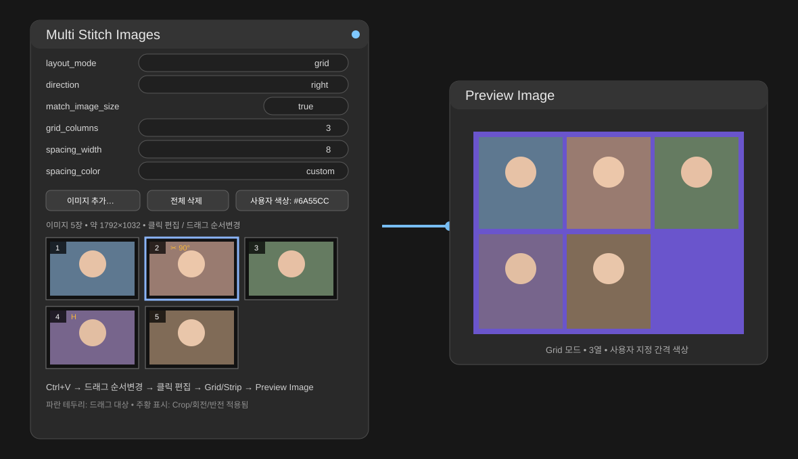
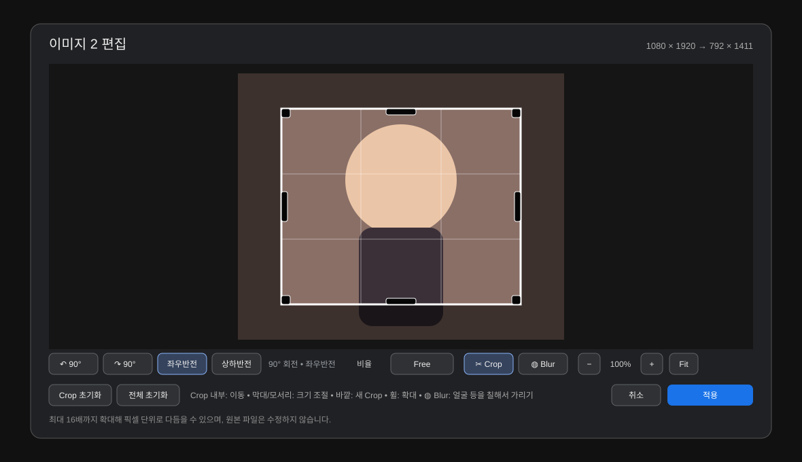
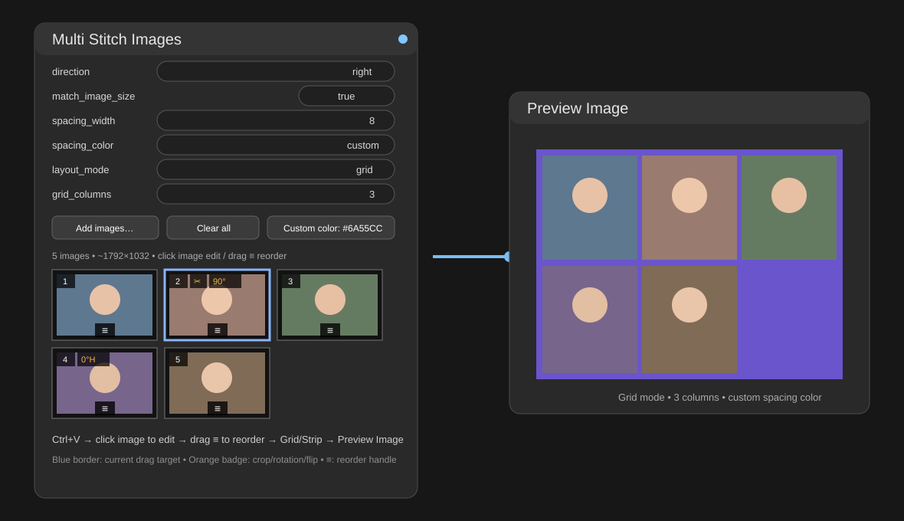
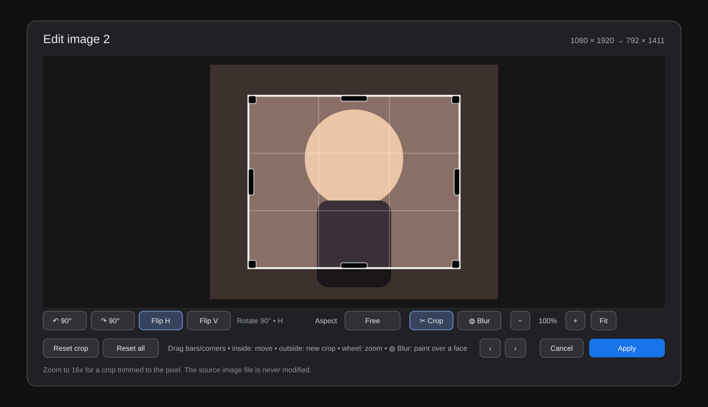

# Comfyui-Image-Stitch

**Multi Stitch Images** for ComfyUI — paste many images into one node, crop / rotate / flip each image, click an image to edit it, drag a card to reorder, then output a classic stitched strip or a configurable grid.

**[한국어](#-한국어) · [English](#-english)**

---

# 🇰🇷 한국어

## 소개

`Multi Stitch Images`는 여러 이미지를 한 노드에 바로 붙여 넣고 편집한 뒤 하나의 `IMAGE`로 합치는 ComfyUI 커스텀 노드입니다.

- **Ctrl+V 다중 이미지 붙여넣기**
- 이미지 클릭 → **즉시 Edit**
- **카드를 그냥 끌어서** 순서 변경 — 놓일 자리는 파란 막대로 표시
- 카드 **우클릭 → Edit · Duplicate · Copy to clipboard · Replace · Remove** — 사진 위에 버튼이 없어 썸네일이 가려지지 않습니다
- **Duplicate**로 같은 이미지 한 장 더 넣기 — 사본은 따로 Crop·회전할 수 있습니다
- **카드마다 해상도 표시** — Crop한 이미지는 Crop 후 크기까지, 편집기 헤더는 드래그 중에도 실시간
- **블러 브러시** — 편집기에서 얼굴·번호판 등을 칠해서 가림. 두께/강도 조절, 원본 비파괴
- **`⧉ Copy` 버튼 → 합성 결과를 Queue 없이 바로 클립보드 복사**
- **동영상에서 장면 캡처** — 프레임 단위로 찾아 원본 해상도 PNG로 목록에 추가, 동영상은 저장 공간을 차지하지 않음. 브라우저가 못 여는 코덱은 서버(PyAV)가 디코딩
- **기준 이미지 크기 출력** — `width`/`height` 출력 단자와 크기 패널: 기준 이미지 크기를 MP 목표로 조정하고 배수(기본 32)로 맞춤
- **갤러리** — 실행한 구성(이미지·Crop·순서·설정)이 미리보기와 함께 기록되어 언제든 다시 불러오기, 안 쓰는 파일 정리까지
- **이미지별 개별 출력 단자** — `output_cells`를 켜면 `image_1`…`image_8`로 한 장씩 따로, 여백 없이
- 툴바 한 줄 `+ Add · Clear · ⧉ Copy · ↶ ↷ · Preview · Options` — 고급 옵션은 **접혀 있고** 기본값이 아닌 것만 표시
- 이미지별 **Crop / 90° Rotate / Flip H / Flip V**
- Free Crop용 **상/하/좌/우 + 모서리 핸들**
- **Strip / Grid** 레이아웃
- `direction`: `right / down / left / up`
- `match_image_size`
- `spacing_width`
- 기본색 + **Custom spacing color**
- 노드 내부 **예상 최종 해상도 표시**
- 노드 내부 **최종 합성 미리보기** (Queue 전에 실제 배치 확인)
- 출력 크기 옵션: **`output_limit`**, Grid **셀 크기 고정**
- **IMAGE 입력 여러 개**(`images`, `images_2`…) — 들어오는 그림이 노드 안에 카드·미리보기로 보이고, 제목줄 **`▶ Inputs`** 로 앞쪽 노드(Crop Head 등)만 실행해 미리 확인 + 개별 **`cells`** 출력
- **↶ / ↷ 실행 취소·다시 실행**
- 이미지 수에 맞춰 **아래로 늘어나는 목록** (스크롤 없음)
- 파일이 사라진 이미지 **재연결** (Crop·순서 유지)
- 초대형 결과 생성 전 **Output Size Safety Guard**
- 일반 `IMAGE` 출력 → `Preview Image`, `Save Image`, `VAE Encode` 등에 바로 연결
- 추가 Python 패키지 불필요 — 동영상 서버 디코딩에만 PyAV가 쓰이고 최신 ComfyUI에는 이미 포함되어 있습니다(ComfyUI-Manager용 `requirements.txt`에도 적어 두었습니다)

## 빠른 시작

1. **노드 추가** — 캔버스를 더블클릭해 `Multi Stitch Images`를 검색합니다(`image/transform`).
2. **이미지 넣기** — 노드를 클릭해 선택하고 **Ctrl+V**. `+ Add`나 드래그 앤 드롭도 됩니다.
3. **다듬기** — 카드를 클릭하면 Crop·회전·블러, 끌면 순서 변경, 우클릭하면 복제·복사·교체·삭제입니다.
4. **연결** — `image` 출력을 `Preview Image`나 모델 노드에 연결합니다. Queue 전에도 노드 안 미리보기에 합성 결과가 보입니다.

다른 노드의 결과(예: 얼굴 크롭 노드)를 합치려면 **`images`, `images_2`…** 에 연결하세요. 제목줄의 **`▶ Inputs`** 는 그 앞쪽 노드만 실행해서 카드와 미리보기를 채워 줍니다. 모델이 레퍼런스를 **한 장씩** 받아야 하면 `output_cells`를 켜고 `image_1`, `image_2`… 를 연결하면 됩니다.

바로 열어 볼 수 있는 예제는 사이드바 Templates → `Comfyui-Image-Stitch` 에 있습니다.

## 최근 변경

### 1.13에서 달라진 점

- **입력 미리보기가 10배 빨라졌습니다 (1.13.1)** — 입력 그림을 노드에 보여 주려고 실행마다 저장하던 미리보기가 스티치 자체보다 훨씬 오래 걸렸습니다(1024px 2장에서 약 290ms, 4K 2장에서 약 1.1초). 이제 큰 그림은 먼저 줄인 뒤 **JPEG(품질 95)** 로 저장해서 각각 약 30ms, 약 0.3초입니다. 카드 우클릭 `Copy`는 이 미리보기를 복사하므로 **최대 1536px**이고, 알림에 복사한 크기가 표시됩니다(Load Image를 바로 연결한 그림은 원본 파일 그대로 복사됩니다).
- **카드가 많을 때 다시 가벼워졌습니다 (1.13.1)** — 입력 카드를 카드마다 다시 계산하던 것을 한 번만 하도록 바꿨습니다. 이미지 256장 + 입력 8개에서 마우스를 움직일 때마다 4.6ms 걸리던 계산이 0.3ms로 줄었습니다(보통의 장수에서는 차이를 느낄 수 없습니다).
- **예제 워크플로우 (1.13.1)** — `Batch Images`로 묶을 필요 없이 입력 단자에 바로 연결하는 방식으로 바꿨습니다(`multi-stitch-grid-from-several-inputs`, 예전 `…-from-image-batch`의 후속). 크롭한 그림과 다른 그림을 `image_1` / `image_2`로 한 장씩 꺼내는 `multi-stitch-references-one-by-one`도 추가했습니다.
- **`▶ Inputs` 버튼** — IMAGE 입력에 뭔가 연결되어 있으면 노드 제목줄(Size 왼쪽, Vue 모드는 툴바)에 나타납니다. 누르면 **이 노드에 연결된 앞쪽 노드들(Crop Head 등)과 이 노드까지만 실행**하고, 뒤에 이어진 H3 같은 무거운 모델은 돌리지 않습니다. 결과가 오면 입력 카드와 미리보기가 바로 채워집니다. 실행을 기다리는 입력이 있으면 초록색으로 켜지고, 자리 카드(`▶ Click to run the inputs`)를 눌러도 똑같이 실행됩니다.
- 이를 위해 노드가 ComfyUI의 **출력 노드**가 되었습니다. 그래서 아무 데도 연결되지 않았어도 Queue할 때마다 함께 실행됩니다(가벼운 작업입니다). 대신 **아무것도 이 노드를 읽지 않을 때는 에러로 실행 전체를 멈추지 않습니다** — 이미지를 아직 안 넣은 빈 노드가 캔버스에 있어도 괜찮고, 그 에러는 나중에 뭔가를 연결하면 그 노드에서 같은 문구로 알려 줍니다. 연결되어 쓰이는 노드는 예전과 똑같이 에러를 냅니다.
- 부분 실행을 지원하지 않는 오래된 ComfyUI에서는 버튼이 전체 실행 대신 안내만 띄웁니다.

이전 버전의 변경 내역은 [CHANGELOG.md](CHANGELOG.md)에 있습니다.

> 아래 한국어 이미지는 이해를 돕기 위해 일부 버튼/설명을 번역한 가이드 이미지입니다. 실제 노드의 옵션 이름은 ComfyUI 언어 설정에 따라 영문 또는 한국어로 표시됩니다.

## 전체 사용 예시



## 설치 — Step by Step

### 방법 A — Git 설치 권장

**1. ComfyUI를 종료합니다.**

**2. ComfyUI의 `custom_nodes` 폴더를 엽니다.**

```text
ComfyUI/custom_nodes/
```

**3. 해당 폴더에서 터미널 / CMD / PowerShell을 엽니다.**

**4. 아래 명령을 실행합니다.**

```bash
git clone https://github.com/ssain3d-lgtm/Comfyui-Image-Stitch.git
```

**5. ComfyUI를 다시 실행합니다.**

**6. 노드 검색에서 `Multi Stitch Images`를 찾습니다.**

```text
image/transform → Multi Stitch Images
```

끝입니다. `pip install`은 필요하지 않습니다.

### 방법 B — ZIP 설치

1. GitHub에서 **Code → Download ZIP**
2. 압축 해제
3. 폴더를 `ComfyUI/custom_nodes/Comfyui-Image-Stitch/`에 넣기
4. ComfyUI 재시작

> 폴더가 `Comfyui-Image-Stitch/Comfyui-Image-Stitch/...`처럼 이중으로 들어가지 않게 확인하세요.

### 방법 C — ComfyUI Manager

Comfy Registry에 게시된 뒤에는 ComfyUI Manager의 **Custom Nodes Manager**에서 `Multi Stitch Images`를 검색해 설치할 수 있습니다.

## 업데이트

이미 설치되어 있다면:

```bash
cd Comfyui-Image-Stitch
git pull
```

그 다음 ComfyUI를 완전히 재시작하고, 프론트엔드 변경이 보이지 않으면 브라우저에서 `Ctrl+F5`를 한 번 실행하세요.

## 사용법 — Step by Step

1. **`Multi Stitch Images` 노드를 추가**합니다.
2. 노드를 한 번 클릭해 **선택**합니다.
3. 이미지 파일/브라우저 이미지/스크린샷을 복사한 뒤 **Ctrl+V** 합니다.
   - 파일로 추가하려면 툴바의 **`+ Add`**(또는 비어 있는 점선 상자 클릭)를 씁니다. 업로드 중에는 노드 제목에 진행률(`uploading 2/5…`)이 표시되고 `+ Add`가 **`Cancel 2/5`**로 바뀝니다. 취소하면 이미 올라간 이미지는 남고 나머지만 중단됩니다. 업로드 중 `Clear`는 업로드까지 함께 취소합니다.
   - 한 노드에 최대 **256장**입니다. 넘치는 파일은 업로드 전에 건너뛰고 알려줍니다.
   - 썸네일은 긴 변 **512px**로 축소한 사본만 유지하므로 고해상도 이미지를 많이 넣어도 브라우저 메모리가 원본 크기만큼 늘지 않습니다. 편집기와 실제 합성은 항상 원본을 사용합니다.
4. 편집할 이미지는 **썸네일을 한 번 클릭**합니다.
5. 순서를 바꾸려면 **카드를 그대로 끌어다 놓습니다**. 끄는 동안 놓일 자리가 **파란 막대**로 표시됩니다.
   - 썸네일을 **우클릭**하면 `Edit · Duplicate · Copy to clipboard · Replace · Remove` 메뉴가 나옵니다. `Copy image #N to clipboard`는 **편집 전 원본 이미지 전체**를 클립보드에 넣습니다 — 그대로 **Ctrl+V**로 다시 붙여 넣거나 다른 프로그램에 붙일 수 있습니다.
   - 툴바의 **`⧉ Copy`** 버튼(또는 우클릭 → `Copy stitched result`)은 지금 설정대로 **합성된 결과**를 원본 해상도로 브라우저에서 만들어 PNG로 클립보드에 넣습니다 — Queue를 돌리지 않아도 됩니다.
6. `layout_mode`를 선택합니다.
   - `strip` → 기존 Stitch Images처럼 한 줄/한 열로 연결
   - `grid` → 여러 행/열로 자동 배치
7. `direction`, `match_image_size`, `spacing_width`, `spacing_color`를 설정합니다.
8. Grid라면 `grid_columns`를 지정합니다.
9. 원하는 색이 필요하면 `spacing_color = custom` 후 **`Custom color: …`** 버튼을 사용합니다.
10. `IMAGE` 출력을 **Preview Image**에 연결하고 Queue를 실행합니다.
11. 썸네일 위 **미리보기 띠**에서 배치를 확인합니다. 결과 전체 크기를 제한하려면 `output_limit`, Grid 셀 크기를 고정하려면 `grid_cell_width / height`를 설정합니다.
12. 생성·업스케일 결과를 바로 붙이려면 `images` 입력에 IMAGE를 연결합니다. 개별 이미지가 필요하면 `output_cells`를 켜고 `cells` 출력을 씁니다.

## 이미지 편집기



썸네일 이미지 영역을 한 번 클릭하면 이미지별 편집기가 열립니다.

- Crop 내부 드래그 → 영역 이동
- **상/하/좌/우 검정 막대 핸들** → 해당 변만 조절
- **모서리 검정 핸들** → 가로/세로 동시 조절
- Crop 바깥 드래그 → 새 Crop 영역 생성
- 비율 프리셋: `Free / Original / 1:1 / 4:3 / 3:2 / 16:9 / 9:16`
- `↶ 90° / ↷ 90°`
- `Flip H / Flip V`
- `Reset crop`
- `Reset all`
- **크기 표시**: 헤더가 `1080 × 1920 → 792 × 1411`처럼 **원본 크기와 지금 Crop의 크기**를 드래그하는 동안 계속 보여 줍니다
- **`‹` `›` 또는 좌우 방향키**: 편집기를 닫지 않고 다음/이전 이미지로. 바꾼 게 있을 때만 저장됩니다
- **`◍ Blur` 탭**: 드래그해서 블러 칠하기. **Brush**=두께, **Blur**=강도, `Ctrl+Z`=마지막 스트로크 취소, `Clear blur`=전체 삭제. Crop·회전과 마찬가지로 좌표로 저장되어 원본은 그대로입니다
- **우클릭**: `Copy crop to clipboard`(Crop된 부분만 원본 해상도로) / `Copy whole image to clipboard` — 편집기의 격자나 테두리는 복사되지 않습니다
- **확대 / 이동**: 휠(포인터 기준 확대), `+ / − / Fit` 버튼, 키보드 `+ / - / 0`. 이동은 **휠 버튼 드래그** 또는 **Space + 좌클릭 드래그**. 최대 16배까지 확대되며, 확대하면 핸들이 잡는 범위와 최소 Crop 크기도 함께 작아져 픽셀 단위로 다듬을 수 있습니다.

회전 / 반전은 **잡아둔 Crop 영역을 그대로 유지**합니다. Crop은 이미지 내용을 따라 함께 회전·반전되므로, 편집 순서에 상관없이 같은 영역이 선택된 상태로 남습니다. Crop을 전체로 되돌리려면 `Reset crop`을 사용하세요.

Crop / 회전 / 반전 정보만 workflow에 저장하는 **비파괴 방식**이라 원본 이미지 파일은 수정하지 않습니다.

## Drag Reorder

카드 위에는 버튼이 하나도 없습니다. 사진 전체가 클릭·드래그 영역이고, 나머지는 우클릭 메뉴입니다.

- **카드 클릭**(누르고 그 자리에서 떼기) → Edit 즉시 열기
- **카드를 끌기** → 순서 변경. 놓일 자리가 **파란 막대**로 카드 사이에 표시되고, 끌리는 카드는 반투명해집니다.
- **카드 우클릭** → `Edit · Duplicate · Copy to clipboard · Replace · Remove` — 복사는 **Crop·회전·블러가 적용된 모습**이고, 편집한 이미지에는 `Copy as uploaded`(원본 파일)가 하나 더 붙습니다
- 카드 **오른쪽 아래 모서리**에 **그 이미지의 픽셀 크기**가 작게 표시됩니다. Crop한 카드는 Crop 후 크기를 주황색으로 보여 주고, 마우스를 올리면 상태 줄에 원본 크기까지 함께 나옵니다.
- 툴바 **`⧉ Copy`** → 합성 결과 복사
- Drag 판정 거리는 ComfyUI Canvas 좌표가 아닌 **실제 화면 픽셀 기준**이라 Zoom 배율에 영향을 덜 받습니다. 그 거리를 넘지 않고 떼면 클릭으로 처리되어 편집기가 열립니다.

## 여러 장 한 번에 편집

- 카드의 **번호가 체크박스**입니다 — 클릭하면 선택, 다시 누르면 해제됩니다. 선택된 카드는 테두리로 표시되고 상태 줄이 개수를 알려 줍니다.
- 선택된 카드를 우클릭하면 **그룹 전용 메뉴**가 열려 `Crop … to`(비율 일괄 적용)·회전·반전·Crop 초기화·복제·맨 앞/뒤로 이동·삭제를 **한 번의 실행 취소 단위로** 처리합니다.
- 선택된 카드 하나를 끌면 **그룹 전체가 함께 이동**합니다. 노드 우클릭 메뉴의 `Select all images` / `Deselect …` 로 전체 선택·해제도 할 수 있습니다.
- Ctrl·Shift 같은 수식키를 쓰지 않는 이유: ComfyUI가 노드에 넘기는 마우스 이벤트는 어떤 키를 눌러도 수식키가 모두 false로 오고, Ctrl+드래그는 캔버스의 다중 노드 선택이 이미 쓰고 있기 때문입니다.

## Strip / Grid

### Strip

기존 ComfyUI `Stitch Images` 방식과 비슷하게 한 방향으로 이미지를 계속 연결합니다.

- `right`
- `left`
- `down`
- `up`

### Grid

`grid_columns`가 최대 열 수가 됩니다.

```text
grid_columns = 3

1  2  3
4  5  6
7  8
```

`direction`에 따라 Grid 채우기 방향도 바뀝니다.

- `right` → 좌 → 우, 위 → 아래
- `left` → 우 → 좌, 위 → 아래
- `down` → 위 → 아래, 좌 → 우
- `up` → 아래 → 위, 좌 → 우

`match_image_size = true`이면 **기준 이미지**의 크기를 셀 기준으로 사용하고 다른 이미지는 종횡비를 유지한 채 Fit 합니다. Strip에서는 기준 이미지의 높이(세로 Strip은 너비)에 맞춥니다. 기준은 `match_reference`로 고릅니다(`match_image_size`가 켜져 있을 때 툴바 `Options ▸` 안에 있습니다).

- `smallest` (기본) — 가로 Strip에서는 가장 낮은 이미지, 세로 Strip에서는 가장 좁은 이미지, Grid에서는 면적이 가장 작은 이미지. 나머지가 **축소**되므로 어떤 이미지도 확대되지 않아 화질이 유지됩니다.
- `largest` — 반대로 가장 높은/넓은/큰 이미지. 나머지가 **확대**됩니다.
- `first` — 목록의 첫 번째 이미지(편집 여부와 무관). ComfyUI 기본 Stitch Images와 같은 규칙이며, 이 옵션이 생기기 전에 저장한 워크플로우는 이 값으로 열립니다.

기준 이미지는 원래 크기를 유지하고, 같은 값이면 앞선 이미지가 기준이 됩니다. 순서를 바꾸지 않아도 되므로, 세로 사진 옆에 작은 가로 사진을 붙일 때 `smallest`로 두면 세로 사진만 줄어 나란히 맞습니다. `direction`이 `left` / `up`이면 첫 번째 이미지가 화면상 **마지막**에 그려집니다.

## 동영상에서 장면 캡처

`+ Add`나 드래그 앤 드롭으로 **동영상 파일**(mp4·webm·mov 등 브라우저가 재생할 수 있는 형식)을 넣으면 목록 끝에 🎞 카드가 생기고 **프레임 선택기**가 열립니다. 재생·스크러버·프레임 단위 이동(←/→, Shift를 누르면 10프레임)으로 장면을 찾고 **Capture**(Enter)를 누르면, 그 순간 화면에 보이는 프레임이 **원본 해상도 PNG**로 업로드되어 보통 이미지처럼 목록에 들어갑니다. Crop·회전·순서 변경·미리보기·복사·실행이 모두 같습니다. 한 번 열어 여러 장을 캡처할 수 있고, 동영상 카드를 다시 클릭하면 선택기가 다시 열립니다.

동영상은 **저장 공간을 차지하지 않습니다.** ComfyUI의 temp 폴더(`temp/multi_stitch_video/`)에만 올라가고 워크플로우에는 저장되지 않으며, 선택기의 **Done**, 카드의 **×**, `Clear`, 페이지를 닫을 때 서버에서 지워집니다(캡처한 PNG는 남습니다). 노드를 지워도 몇 초 뒤 지워집니다 — 실행 취소로 그래프가 다시 만들어지면 같은 노드가 동영상과 함께 돌아오기 때문입니다. 브라우저가 비정상 종료돼 남은 파일은 ComfyUI가 다음 시작 때 temp 폴더를 비우면서 정리됩니다. 실행 시에는 캡처된 PNG만 합쳐지고 동영상은 무시됩니다.

- 프레임 이동은 `requestVideoFrameCallback`으로 실제 표시된 프레임의 시각을 읽어 처리하며, 영상이 준비되면 음소거로 잠깐 재생해 fps를 감지합니다(Chromium·Safari). 그 밖의 브라우저는 시간 기준으로 이동하고, 감지가 안 되면 선택기의 fps 칸에 직접 입력하면 됩니다.
- 업로드 크기는 ComfyUI 한도(기본 100 MB, `--max-upload-size`로 조정)를 따릅니다.

**서버 디코딩(PyAV)** — 브라우저가 재생하지 못하는 코덱(HEVC 일부, ProRes, MKV 등)이면 선택기가 자동으로 **서버 모드**로 바뀝니다. 미리보기 프레임은 서버의 PyAV(ffmpeg)가 만들어 보내고(`/multi_stitch/video/info`, `/multi_stitch/video/frame`), 스크러버와 프레임 이동은 컨테이너의 실제 fps를 따르며, **Capture**는 서버가 디코딩한 프레임을 그대로 PNG로 저장해(`/multi_stitch/video/capture`) 목록에 넣습니다. 재생되는 동영상에서도 선택기의 **server capture** 체크를 켜면 화면에 보이는 시각의 프레임을 서버가 디코더 그대로 뽑아 줍니다. 최신 ComfyUI에는 PyAV(`av` 패키지)가 포함되어 있고, 없으면 `pip install av` 후 재시작하세요. 둘 다 못 열면 선택기가 그렇게 알려 줍니다.

## 크기 패널 · width / height 출력

노드에는 `image`·`cells` 외에 **`width`**·**`height`**(INT) 출력이 있습니다. 값은 **기준 이미지**의 크기(자르기·회전 적용 후)에서 나옵니다.

- `size_reference` — 기준 이미지의 **번호**: `1`(기본) = 목록의 첫 번째, `2` = 두 번째… IMAGE 입력의 프레임은 붙여 넣은 이미지 뒤에 이어서 세고, 끝을 넘는 번호는 마지막 이미지를 씁니다(패널에 표시).
- `size_megapixels` — `0`(기본)이면 기준 이미지의 픽셀 수 그대로, 값을 주면 비율을 유지한 채 그 메가픽셀로 확대·축소합니다.
- `size_divisible_by` — 각 변을 이 값의 배수로 반올림합니다(기본 `32`, 최소 이 값). 예: 1440×2560을 0.8 MP·32로 → **672×1184**.
- `size_aspect` — 출력의 **비율**입니다. 크기 패널을 켜면 상자 아래 **칩을 눌러 바로 바꿀 수 있습니다**(`auto`가 `reference`). 기본 `reference`는 기준 이미지의 비율 그대로이고, `1:1`·`16:9`·`9:16`·`4:3`·`3:4`·`3:2`·`2:3` 중 하나를 고르면 그 비율로 바꿉니다. **픽셀 수는 기준 이미지 그대로 유지**하므로(=`size_megapixels`가 0보다 크면 그 값) 비율만 바뀌고 생성 부담은 그대로입니다. 예: 1200×1600(3:4)에 `9:16` → **1024×1856**. 원본은 3:4인데 모델에는 9:16으로 넣어야 할 때 노드를 하나 더 붙일 필요가 없습니다.

이 출력은 `Empty Latent Image`나 리사이즈 노드에 바로 연결해 쓰는 용도입니다. 제목줄 오른쪽의 **`📐 Size`** 버튼(또는 우클릭 → `Show size panel`)을 켜면 노드 아래에 그 크기의 비율 상자와 `672 x 1184 | 9:16 | 0.80 MP | divisible by 32` 읽기, 그리고 어느 이미지에서 나왔는지가 표시되고 위 세 위젯이 나타납니다. 끄면 위젯도 함께 숨겨지며(기본 위젯은 그대로 5개), 켜짐 여부는 워크플로우에 저장됩니다. 계산은 백엔드와 같은 식(`_reference_size` ↔ `referenceSize`)을 쓰고 CI에서 대조합니다.


## 미리보기 · 목록 · 편집 이력

**툴바와 Options** — 위젯 아래 한 줄에 `+ Add · Clear · ⧉ Copy · ↶ ↷ · Preview · Options`가 있고, 버튼용 위젯 행은 없습니다. 자주 쓰지 않는 옵션(`output_limit` 이후: 출력 제한, Grid 셀 크기, `output_cells`, `cells_resolution`, `minimum_image_side`, `match_reference`)은 **`Options ▸`를 눌러야 보입니다**. 단 **기본값이 아닌 값은 접혀 있어도 항상 표시**되고 `Options ▸ (2)`처럼 개수를 알려 주므로, 숨은 설정이 몰래 결과를 바꾸는 일은 없습니다. 접힘 여부는 워크플로우에 저장됩니다. 기본 상태의 위젯은 `direction`, `match_image_size`, `spacing_width`, `spacing_color`, `layout_mode`(Grid면 `grid_columns`) 다섯 개입니다.

**갤러리** — 제목 표시줄의 **`🖼`**(물음표 왼쪽, `📐 Size` 옆)을 누르면 이 노드로 스티치했던 구성이 미리보기와 함께 나옵니다. 한 번 실행할 때마다 이미지 목록·Crop·순서·설정이 한 항목으로 기록되고, 같은 구성을 또 실행하면 항목은 하나로 유지된 채 사용 횟수만 올라갑니다. **같은 구성인지는 파일 이름이 아니라 이미지 내용(크기 + 해시)으로 판단**하므로, 같은 사진을 다시 붙여넣어 새 파일로 올라가도 항목이 두 개로 늘지 않습니다. 대신 중복된 파일이 어느 항목에서도 안 쓰이게 되어 `Clean up unused files…`로 정리할 수 있습니다. (한 구성 안에서 같은 사진을 **일부러 두 장** 쓴 것은 그대로 두 장으로 셉니다.)

- **Load**는 그 구성을 노드에 그대로 되돌립니다(이미지와 설정 함께). **Add**는 현재 목록 뒤에 이미지만 덧붙입니다.
- 이름은 클릭해서 바꿀 수 있고, 항목은 최대 200개까지 보관하며 넘치면 가장 오래 안 쓴 것부터 사라집니다. 미리보기의 **`☆`를 누르면 고정(Pin)** 되어 목록 맨 앞으로 오고 **200개 정리 대상에서 제외**됩니다. **`Load`·`Add`로 불러오는 것도 "사용"으로 쳐서** 맨 앞으로 올라오므로, 자주 꺼내 쓰는 구성이 밀려나지 않습니다. 항목은 `input/multi_stitch/gallery/`에 파일로 남아 ComfyUI를 재시작해도 그대로입니다.
- **`save every run`** 체크를 끄면 자동 기록을 멈추고 **`＋ Save current`** 로만 저장합니다. 이 설정은 서버(`input/multi_stitch/gallery/settings.json`)에 저장되므로 위젯이 늘지 않고, 기존 워크플로우도 그대로입니다.
- 머리글에 `input/multi_stitch` 용량과 **어떤 항목에도 안 쓰이는 파일**의 용량이 나오고, **`Clean up unused files…`** 로 그만큼만 지웁니다. 열려 있는 노드가 쓰는 파일은 절대 지우지 않지만, **디스크에 저장된 워크플로우가 참조하는 파일은 알 수 없으므로** 확인 창에서 그 점을 알려 줍니다.
- 항목 삭제는 기본적으로 이미지 파일을 남기고, **`Delete + files`** 는 다른 항목과 열린 노드가 안 쓰는 파일만 함께 지웁니다.

**카드 조작** — 이미지 카드에는 오른쪽 위 **`×` 삭제** 하나와 왼쪽 위 **번호**(클릭하면 선택), 그리고 Crop·회전 표시뿐입니다. `×`는 카드를 집어 드는 것보다 먼저 처리되므로 눌러도 드래그가 시작되지 않습니다. 사진이 버튼에 가리지 않도록 한 것으로, **클릭 = Edit**, **드래그 = 순서 변경**, **우클릭 = 나머지 전부**입니다. 카드를 우클릭하면 **그 카드 전용 메뉴**(제목 `Image #N`)가 열리고 `Edit image #N…`, `Duplicate image #N`, `Copy image #N to clipboard`, `Replace image #N…`, `Remove image #N` 다섯 개만 나옵니다 — 노드 메뉴(Bypass·Colors·Clone·Remove…)에 섞이지 않습니다. 노드의 제목·위젯·빈 공간을 우클릭하면 평소의 노드 메뉴가 그대로 열리고, 거기에는 노드 전체에 대한 `Copy stitched result`·크기 패널·갤러리만 들어 있습니다. **Duplicate**는 노드 안에 바로 한 장 더 넣고, **Copy to clipboard**는 **클립보드**로 복사해 Ctrl+V나 다른 프로그램에 쓸 수 있게 합니다. (동영상 카드는 클릭이 프레임 선택기를 여는 자리라 `×` 버튼을 그대로 둡니다.) 노드를 **넓히면 한 줄에 들어가는 카드 수가 늘어납니다**(기본 420px에서 3장, 1200px에서 8장) — 카드가 늘어나는 대신 장수가 늘어 목록이 짧아집니다. 카드에 마우스를 올리면 상태 줄이 **`Click to edit · drag to reorder · right-click for more`** 로 바뀌고 커서가 손가락 모양이 되므로, 버튼이 없어도 무엇을 할 수 있는지 그 자리에서 알 수 있습니다.

**Duplicate** — 같은 이미지를 바로 뒤에 한 장 더 넣습니다. 이미 업로드된 파일을 가리키기만 하므로 다시 올리지 않고, 사본의 Crop·회전·반전은 원본과 따로 편집됩니다. 실행 취소도 됩니다.

**Vue 노드 모드** — ComfyUI 설정의 **Vue Nodes**(Nodes 2.0)를 켜면 노드 본문이 Vue 컴포넌트로 그려져 캔버스에 직접 그리던 상태 줄·툴바·미리보기·썸네일·크기 패널이 보이지 않았습니다. 이제 그 모드에서는 같은 화면을 DOM으로 그리며, 버튼과 카드는 캔버스와 **동일한 함수**를 호출합니다. 이 표시용 위젯은 워크플로우에 저장되지 않습니다.

**최종 합성 미리보기** — 썸네일 위의 띠에 실제 배치(Strip/Grid, 방향, 간격, 배경색, 출력 크기 제한)를 축소해 보여줍니다. 백엔드와 **같은 레이아웃 계산**(`_layout` ↔ `layoutPlacements`)을 쓰고 CI에서 픽셀 단위로 대조하므로, Queue 전에 보이는 배치가 곧 결과입니다. 툴바의 **`Preview`** 버튼으로 끄고 켤 수 있고(워크플로우에 저장), 아직 로드되지 않았거나 없는 이미지는 `?` 자리표시자로 표시됩니다. 평소에는 512px 썸네일로 바로 그리지만, 캔버스를 확대하거나 고해상도 화면이라 썸네일을 늘려야 할 만큼 커지면 **원본 파일로 합성본을 다시 그려**(긴 변 2048px·4 MP 이내, 노드당 하나 캐시) 선명하게 보여 줍니다. 배치나 이미지가 바뀌면 다시 그리고 그동안은 썸네일 버전이 보입니다. 축소는 절반씩 단계적으로 줄이는 고품질 방식이라 썸네일·미리보기·복사 결과 모두 계단 현상이 없습니다.

**합성 결과 복사** — 툴바의 **`⧉ Copy`** 버튼은 미리보기와 같은 배치를 **원본 파일**로 다시 그려(썸네일이 아니라) 최종 크기의 PNG를 클립보드에 넣습니다. 이미지를 한 장씩 불러와 그리므로 진행률이 노드 제목에 표시됩니다. 브라우저 canvas 한도 때문에 **64 MP**까지만 렌더링하며, 그보다 크면 `output_limit`을 쓰거나 Queue로 실행하라고 알려줍니다. 연결된 `images` 입력의 프레임은 실행 시점에만 존재하므로 포함되지 않고, 로드에 실패한 이미지는 배경색으로 비워 둔 채 알려줍니다. 축소 리샘플링은 브라우저 방식이라 백엔드(bicubic)와 픽셀이 미세하게 다를 수 있습니다.

**목록 높이** — 썸네일 목록은 이미지 수만큼 노드가 아래로 늘어나 모든 카드가 항상 보입니다. 스크롤바는 없고 높이는 자동으로 정해지며, 노드는 가로 폭만 조절할 수 있습니다.

**실행 취소 / 다시 실행** — 툴바의 **`↶` / `↷`** 버튼이 추가·삭제·순서 변경·Crop/회전 편집·교체·Clear를 되돌립니다(최근 50단계, 노드가 열려 있는 동안 유지, 워크플로우를 다시 열면 초기화). ComfyUI 자체의 Ctrl+Z와는 별개입니다.

**누락 이미지 교체** — 워크플로우를 옮겨 원본 파일이 없으면 카드에 `Cannot preview here` 또는 `Missing · click to relink`가 표시됩니다. 30초 안에 로드되지 않으면 `Timed out · click to retry`가 되고, 한 번 더 시도한 뒤에도 실패하면 재연결을 권합니다. 브라우저가 못 읽는 형식(TIFF·PSD·HEIC)은 서버에서는 정상 스티치되므로 그렇게 안내합니다. 카드를 클릭(또는 우클릭 → `Replace image #N…`)해 새 파일을 고르면 **Crop·회전·반전·순서를 유지한 채** 파일만 바뀝니다. 이 교체도 실행 취소할 수 있습니다.

## IMAGE 입력 · 개별 셀 출력

- 선택 입력 **`images`**, **`images_2` … `images_8`** (IMAGE, 하나를 연결하면 다음 단자가 열림): 연결된 배치의 프레임들이 입력 순서대로 붙여넣은 이미지 **뒤에** 추가됩니다. 생성/업스케일 결과를 저장·재업로드 없이 바로 합칠 수 있고, 붙여넣은 이미지 없이 배치만 연결하면 "배치 → 그리드" 노드로도 씁니다. RGBA 프레임은 배경색 위에 합성되고 1채널은 RGB로 확장됩니다. 들어오는 그림은 청록색 입력 카드와 미리보기에 표시됩니다 — Load Image를 바로 연결하면 즉시, 계산이 필요한 노드를 거치면 한 번 실행한 뒤부터(1.12). **`▶ Inputs`** 는 앞쪽 노드와 이 노드만 실행해서 그 그림을 가져옵니다(1.13). 붙여넣은 이미지 + 프레임 합계가 256장 상한이고, 각 프레임에도 원본 1장 크기 한도가 적용됩니다. 프레임은 자기 차례에만 CPU float32로 변환되므로 GPU 배치를 연결해도 한꺼번에 복사되지 않습니다.
- 출력 **`image`**: 합성 결과. 출력 **`cells`**: `output_cells = true`일 때 이미지마다 한 프레임씩, **같은 크기의 셀** 가운데에 배경색으로 패딩한 배치 `[N, H, W, 3]`입니다. 얼굴 클로즈업처럼 개별 참조를 따로 넘길 때 씁니다. `false`면 `image`와 같은 텐서를 내보내 출력이 비지 않습니다. 셀 배치 전체에도 같은 크기 안전 한도가 적용되며, 이 검사는 디코딩 전에 끝납니다.
- 출력 **`image_1` … `image_8`** (`output_cells`를 켜면 생깁니다): 이미지를 **한 장씩 따로** 꺼냅니다. 레퍼런스를 한 장씩 받아야 하는 모델에 바로 연결할 수 있습니다. 노드에는 가지고 있는 그림 수만큼만 보이고(들어올 그림이 아직 계산 전이면 8개 전부), **연결된 단자는 절대 사라지지 않습니다.** `cells` 배치와 달리 **여백이 붙지 않아서** `image_2`는 합성 결과에서 가지는 크기 그대로(`cells_resolution = source`면 원본 크기) 나옵니다. 그림 수보다 뒤쪽 단자는 1픽셀 검정 이미지를 냅니다(빈 값이 흘러가면 엉뚱한 노드에서 터지기 때문입니다). 새 단자는 `image`·`cells`·`width`·`height` **뒤**에 붙어서 기존 워크플로우의 연결이 밀리지 않습니다.
- **`cells_resolution`** (`output_cells`가 켜져 있을 때 표시): `placed`(기본)는 합성 결과에 놓인 크기 그대로, 셀은 가장 큰 배치 크기입니다. `source`는 **리사이즈 전 원본(Crop 적용) 크기**로 넣고 셀은 가장 큰 원본 크기가 됩니다 — 합성본은 작게 만들면서 개별 참조는 원본 해상도로 받고 싶을 때 씁니다. 이미지별 파일이 필요하면 `cells` 배치를 배치 분리 노드로 나누세요.

## 파라미터

각 위젯과 출력 슬롯에 마우스를 올리면 **툴팁 설명**이 표시됩니다. 아래 표는 그 요약입니다.

| 위젯 | 값 | 기본값 |
| --- | --- | --- |
| `direction` | `right` / `down` / `left` / `up` | `right` |
| `match_image_size` | `true` / `false` | `true` |
| `spacing_width` | `0` – `1024` (step 1) | `0` |
| `spacing_color` | `white` / `black` / `red` / `green` / `blue` / `custom` | `white` |
| `layout_mode` | `strip` / `grid` | `strip` |
| `grid_columns` | `1` – `16` | `3` |
| `custom_spacing_color` | `#RRGGBB` (숨김 위젯, 버튼으로 설정) | `#808080` |
| `output_limit` | `none` / `max_width` / `max_height` / `max_long_side` | `none` |
| `output_limit_px` | `64` – `16384` (`output_limit`가 `none`이 아닐 때 표시) | `2048` |
| `grid_cell_width` / `grid_cell_height` | `0` = 자동, 최대 `16384` (Grid에서만 표시, 둘 다 있어야 적용) | `0` |
| `output_cells` | `true` / `false` | `false` |
| `cells_resolution` | `placed` / `source` (output_cells 사용 시 표시) | `placed` |
| `minimum_image_side` | `0` = 검사 끄기 / 최대 131072px | `0` |
| `match_reference` | `first` / `largest` / `smallest` — `match_image_size`가 켜졌을 때 기준 이미지 | `smallest` |
| `size_reference` | `1` – `256`, `width`/`height` 출력의 기준 이미지 번호 (1 = 첫 번째) | `1` |
| `size_megapixels` | `0` = 기준 이미지 크기 그대로 / 최대 64 MP | `0` |
| `size_divisible_by` | `1` – `512`, 각 변을 이 배수로 반올림 | `32` |
| `size_aspect` | `reference` / `1:1` / `16:9` / `9:16` / `4:3` / `3:4` / `3:2` / `2:3` | `reference` |
| `grid_target_aspect` | `off` / `1:1` / `16:9` / `9:16` / `4:3` / `3:4` / `3:2` / `2:3` — picks the grid's columns | `off` |
| `grid_target_aspect` | `off` / `1:1` / `16:9` / `9:16` / `4:3` / `3:4` / `3:2` / `2:3` — Grid 열 수 자동 선택 | `off` |
| `images` (입력) | 선택 IMAGE 배치 — 붙여넣은 이미지 뒤에 추가 | — |
| `width` / `height` (출력) | 기준 이미지 크기 → `size_megapixels` → `size_divisible_by` 배수 | — |

`output_limit`부터 `minimum_image_side`까지는 툴바의 `Options ▸`를 열어야 보이는 고급 옵션입니다(기본값이 아닌 값은 항상 표시). `match_reference`도 같은 고급 옵션이며 `match_image_size`가 켜져 있을 때만 관련이 있습니다. 목록에 없는 값을 API로 직접 넣으면 조용히 기본값으로 바뀌지 않고 **에러가 발생**합니다.

## Spacing Color

기본값:

```text
white / black / red / green / blue / custom
```

`custom`을 선택한 뒤 **`Custom color: #808080`** 버튼(현재 값이 함께 표시됩니다)을 누르면 브라우저 색상 선택기가 열립니다. 위젯 이름은 `custom_color_picker`입니다.

`spacing_color`는 **배경색 전체**에 적용됩니다 — 이미지 사이 구분선과, 크기가 다른 이미지 주변의 여백(레터박스)이 같은 색으로 채워집니다. Strip / Grid 어느 쪽에서도 동일합니다.

투명 영역이 있는 PNG는 이 배경색 위에 합성됩니다.

## Output Size Safety Guard

여러 장의 고해상도 이미지를 `match_image_size = false`로 길게 붙이면 결과 Tensor가 매우 커질 수 있습니다. 이 노드는 실행 시 **파일 헤더만 읽어** (픽셀 디코딩 없이 — EXIF 방향까지 헤더에서 계산) 최종 캔버스 크기와 각 원본의 크기를 먼저 확인합니다.

합성은 **한 장씩 스트리밍**됩니다: 캔버스를 먼저 할당하고, 원본을 하나 디코딩해 제자리에 넣은 뒤 바로 해제합니다. 따라서 이미지가 몇 장이든 작업 메모리에는 주로 **캔버스 + 처리 중인 원본·리사이즈 버퍼**가 존재합니다. `output_cells=true`이면 셀 배치도 보관합니다. 원본 한 장의 한도는 Crop 이후가 아니라 **디코딩되는 원본 전체 크기** 기준입니다 — 작은 영역만 잘라 써도 디코딩 비용은 원본 전체이기 때문입니다.

기본 안전 한도:

```text
최종 출력: 134.2 MP (128 MiPixels) 이하
원본 이미지 1장: 134.2 MP (128 MiPixels) 이하 (Crop 전 크기 기준)
한 변 최대: 131,072 px
이미지 수: 최대 256장 (노드 UI에서도 같은 상한을 적용)
```

### 출력 크기 지정

기본값은 **원본 기준 유지, 추가 축소 없음**입니다. 참조 시트(예: MiniMax H3 같은 모델의 입력)는 해상도가 곧 세부 정보이므로 기본으로는 줄이지 않습니다. 필요할 때만:

- `output_limit` = `max_width` / `max_height` / `max_long_side` + `output_limit_px`: 완성된 결과를 해당 치수가 `px` 이하가 되도록 **축소만** 합니다(확대 없음, 종횡비 유지). 가로 4장 strip을 2048px로 제한하면 한 장당 약 512px이 됩니다. 참조 모델의 입력 노드가 어차피 다시 축소한다면 여기서 키워도 소용없으니, 실제 전달 해상도는 그 노드의 전처리를 먼저 확인하세요.
- `grid_cell_width` / `grid_cell_height` (Grid): 둘 다 주면 모든 이미지가 그 셀 안에 종횡비를 유지하며 맞춰집니다(예: 768×1024). 한쪽만 주면 자동(첫 이미지 또는 최대 크기)입니다.
- `minimum_image_side` (기본 `0` = 끄기): 값을 주면 합성 결과에 배치되는 **각 이미지의 짧은 변**(출력 제한 적용 후)이 그보다 작아질 때 디코딩 전에 실행을 중단하고 알려줍니다. 참조 시트에서 얼굴이 너무 작게 들어가는 것을 막는 안전장치이며, 모델 쪽 입력 전처리와는 별개입니다.
- 상태줄의 `~W×H`와 미리보기 캡션은 제한이 적용된 **최종 크기**를 보여주고, 캔버스 크기가 다르면 미리보기 캡션에 `(canvas W×H)`를 덧붙입니다. 안전 한도는 축소 전 캔버스에 적용됩니다.

한도를 초과하면 예상 해상도 / MP / float32 메모리 크기를 표시하고 실행을 중단합니다. 이 경우 이미지 수를 줄이거나, Crop/Resize를 하거나, Grid를 사용하거나, `match_image_size = true`를 사용하세요.

## 예제 워크플로우 · 한국어 UI

**예제 워크플로우** — ComfyUI 템플릿 브라우저(사이드바의 Templates)에 `Comfyui-Image-Stitch` 항목으로 세 워크플로우가 나타납니다. `multi-stitch-paste-strip`은 노드를 선택하고 Ctrl+V 하는 기본 흐름입니다. `multi-stitch-grid-from-several-inputs`는 ComfyUI에 포함된 `example.png` 세 장을 `images`·`images_2`·`images_3`에 바로 연결하고(연결하면 다음 단자가 열립니다) 2열 Grid와 `cells` 출력까지 보여 줍니다. `multi-stitch-references-one-by-one`은 크롭한 그림(코어 `Image Crop` — 얼굴 크롭 노드로 바꿔 쓰세요)과 다른 그림을 넣고, 각각을 `image_1`·`image_2` 출력으로 한 장씩 꺼냅니다. 모두 바로 Queue 할 수 있고, 제목줄의 `▶ Inputs`로 앞쪽 노드만 실행해 볼 수도 있습니다. 파일은 `example_workflows/`에 있습니다.

**한국어 UI** — 설정(⚙) → Locale을 한국어로 두면 이 노드의 위젯 이름, 선택지, 툴팁, 노드 설명이 한국어로 표시됩니다(`locales/ko/nodeDefs.json`). 노드 이름 `Multi Stitch Images`와 이 문서의 파라미터 표기는 영문 그대로라 검색과 대조가 그대로 됩니다. 툴바 버튼의 문구는 영문입니다.

## 붙여넣기 / 저장 방식

최신 ComfyUI의 이미지 paste routing을 이용합니다. 노드는 `previewMediaType = "image"`와 `pasteFiles()`를 제공하여 전역 Ctrl+V 가로채기를 최소화합니다.

붙여넣거나 추가한 이미지는 다음 위치에 저장됩니다.

```text
ComfyUI/input/multi_stitch/
```

Workflow에는 다음 상태가 저장됩니다.

- 이미지 참조
- Crop 좌표
- Rotation
- Horizontal / Vertical Flip
- 이미지 순서
- 미리보기 띠 켜짐/꺼짐
- `Options ▸` 접힘 여부
- 크기 패널(`📐 Size`) 켜짐/꺼짐

갤러리는 워크플로우에 저장되지 않습니다. 항목은 서버에 있으므로 어떤 노드에서 열어도, 어떤 워크플로우에서 열어도 같은 목록이 보입니다.

편집 이력(실행 취소)은 저장되지 않습니다. 참조된 파일이 디스크에서 바뀌면(크기·수정 시각) 노드는 ComfyUI 캐시를 무시하고 다음 Queue에서 다시 실행됩니다.

Workflow를 다른 PC로 옮길 경우 참조된 입력 이미지도 같이 옮겨야 합니다. 옮기지 못한 파일은 카드에 `click to relink`로 표시되며, 그 카드를 클릭해 재연결하면 Crop과 순서는 유지됩니다.

---

# 🇺🇸 English

## Overview

`Multi Stitch Images` is a ComfyUI custom node for pasting many images directly into one node, editing each image, and composing the result into a single `IMAGE` output.

- **Paste multiple images with Ctrl+V**
- Click an image → **open Edit immediately**
- **Drag a card** to reorder it — a blue bar shows where it would land
- **Right-click a card** for `Edit · Duplicate · Copy to clipboard · Replace · Remove` — no buttons sit over the picture
- **`⧉ Copy` button → the stitched result on the clipboard without queueing**
- **Capture frames from a video** — find the moment frame by frame, add it as a native-resolution PNG; the video takes no storage, and the server (PyAV) decodes codecs the browser cannot
- **Gallery** — every composition a run stitches is recorded with a preview and can be loaded back into a node; it also shows what the image folder holds and clears what nothing uses
- **A socket per image** — `output_cells` also fills `image_1`…`image_8`, one picture each, unpadded
- **Duplicate an image** — the card menu adds the same file once more, right after it, croppable and rotatable on its own
- **Pixel size on every card** — and what a crop leaves of it, counted live in the editor while you drag
- **Blur brush** — paint over a face or a plate in the editor; adjustable width and strength, stored as coordinates, source untouched
- **Reference-image size outputs** — `width`/`height` outputs and a size panel: the reference image's size rescaled to a megapixel target and snapped to a multiple (32 by default)
- One toolbar row `+ Add · Clear · ⧉ Copy · ↶ ↷ · Preview · Options` — advanced options stay **folded**, only non-default ones show
- Per-image **Crop / 90° Rotate / Flip H / Flip V**
- **Top / bottom / left / right + corner handles** for Free Crop
- **Strip / Grid** layouts
- `direction`: `right / down / left / up`
- `match_image_size`
- `spacing_width`
- Built-in colors + **Custom spacing color**
- **Estimated final resolution** displayed inside the node
- **Composite preview** inside the node — the real layout before you queue
- Output size options: **`output_limit`** and a fixed Grid **cell size**
- **Several IMAGE inputs** (`images`, `images_2`…) — what arrives shows on the node as cards and in the preview, and **`▶ Inputs`** in the title bar runs just the nodes feeding them (a Crop Head, say) to check ahead — plus a per-image **`cells`** output
- **↶ / ↷ undo and redo**
- A list that **grows downward** with the images (no scrolling)
- **Relink** an image whose file went missing, keeping its crop and order
- **Output Size Safety Guard** before giant tensors are allocated
- Standard `IMAGE` output → `Preview Image`, `Save Image`, `VAE Encode`, etc.
- No extra Python packages required — only server-side video decoding uses PyAV, which current ComfyUI already installs (and `requirements.txt` lists it for ComfyUI-Manager)

## Quick start

1. **Add the node** — double-click the canvas and search for `Multi Stitch Images` (`image/transform`).
2. **Add images** — click the node to select it and press **Ctrl+V**. `+ Add` and drag-and-drop work too.
3. **Tidy up** — click a card to crop, rotate or blur it, drag it to reorder, right-click it to duplicate, copy, replace or remove.
4. **Connect** — wire `image` to `Preview Image` or a model node. The node's own preview shows the stitched result before you queue.

To stitch what other nodes produce (a face crop, say), plug them into **`images`, `images_2`…** The **`▶ Inputs`** button in the title bar runs only the nodes feeding them and fills in the cards and the preview. If a model wants its references **one at a time**, turn `output_cells` on and wire `image_1`, `image_2`…

Ready-made examples are under Templates → `Comfyui-Image-Stitch` in the sidebar.

## Recent changes

### What changed in 1.13

- **Input previews are ten times faster (1.13.1)** — the previews written on every run so the node can show what its inputs bring took far longer than the stitch itself (about 290 ms for two 1024px frames, about 1.1 s for two 4K ones). A large frame is now shrunk first and saved as a **JPEG (quality 95)**: about 30 ms and about 0.3 s. `Copy` on a card's right-click menu copies that preview, so it is **at most 1536px**, and the notice says the size it copied (a Load Image connected directly is copied from its own file, unreduced).
- **Many cards are light again (1.13.1)** — the input cards were worked out again for every card; they are worked out once now. With 256 images and 8 inputs the work behind each mouse move went from 4.6 ms to 0.3 ms (at ordinary counts the difference cannot be felt).
- **Example workflows (1.13.1)** — no `Batch Images` to join the pictures: they go straight into the input sockets (`multi-stitch-grid-from-several-inputs`, the successor of `…-from-image-batch`). `multi-stitch-references-one-by-one` is new: a cropped picture and another one, each taken out on its own `image_1` / `image_2`.
- **`▶ Inputs`** — while something is plugged into an IMAGE input, the title bar (left of Size; the toolbar in the Vue mode) offers it. It **runs only the nodes feeding this one (a Crop Head and whatever it reads) and this node**, never the heavy model after it, and the input cards and the preview fill in as soon as the pictures arrive. It lights up while an input waits for a run, and a placeholder card (`▶ Click to run the inputs`) does the same.
- That makes the node an **output node** in ComfyUI's terms, so it runs on every Queue even when nothing reads it (it is cheap). In return, **while nothing reads it, its errors never stop the run**: a fresh node with nothing pasted yet can sit on the canvas, and the error waits, word for word, for whatever gets wired to it. A node that is in use fails exactly as before.
- On a ComfyUI too old to run part of a workflow the button says so instead of running everything.

Earlier changes are in [CHANGELOG.md](CHANGELOG.md).

## Full workflow example



## Installation — Step by Step

### Method A — Git install recommended

**1. Close ComfyUI.**

**2. Open your ComfyUI `custom_nodes` folder.**

```text
ComfyUI/custom_nodes/
```

**3. Open Terminal / CMD / PowerShell in that folder.**

**4. Run:**

```bash
git clone https://github.com/ssain3d-lgtm/Comfyui-Image-Stitch.git
```

**5. Start ComfyUI again.**

**6. Search for `Multi Stitch Images`.**

```text
image/transform → Multi Stitch Images
```

Done. No `pip install` is required.

### Method B — ZIP install

1. GitHub → **Code → Download ZIP**
2. Extract the archive
3. Place it at `ComfyUI/custom_nodes/Comfyui-Image-Stitch/`
4. Restart ComfyUI

> Make sure you do not end up with a nested folder such as `Comfyui-Image-Stitch/Comfyui-Image-Stitch/...`.

### Method C — ComfyUI Manager

Once the node is published on the Comfy Registry, search for `Multi Stitch Images` in ComfyUI Manager's **Custom Nodes Manager** and install it from there.

## Updating

If already installed:

```bash
cd Comfyui-Image-Stitch
git pull
```

Then fully restart ComfyUI. If frontend changes are still cached, refresh the browser once with `Ctrl+F5`.

## Usage — Step by Step

1. Add the **`Multi Stitch Images`** node.
2. Click the node once so it is **selected**.
3. Copy image files, a browser image, or a screenshot and press **Ctrl+V**.
   - To add files, use **`+ Add`** in the toolbar (or click the empty dashed box). While uploading, the node title shows progress (`uploading 2/5…`) and `+ Add` becomes **`Cancel 2/5`**. Cancelling keeps what has already landed and stops the rest. `Clear` during an upload cancels it too.
   - A node holds at most **256** images; files beyond that are skipped before upload, with a notice.
   - Thumbnails keep only a copy scaled to **512px** on the long edge, so many high-resolution images do not grow browser memory by their full size. The editor and the actual stitch always use the original.
4. **Single-click a thumbnail** to Crop / Rotate / Flip it.
5. To reorder, **drag the card itself**; a blue bar shows the slot it would drop into.
   - **Right-click** a card for `Edit · Duplicate · Copy to clipboard · Replace · Remove`. `Copy image #N to clipboard` puts the **whole original image, before any edits**, on the clipboard — paste it back with **Ctrl+V** or into another program.
   - The **`⧉ Copy`** button in the toolbar (or right-click → `Copy stitched result`) renders the **stitched result** with the current settings, at full resolution, in the browser and puts it on the clipboard as PNG — no queue needed.
6. Choose `layout_mode`.
   - `strip` → classic one-row / one-column stitching
   - `grid` → automatic multi-row / multi-column layout
7. Set `direction`, `match_image_size`, `spacing_width`, and `spacing_color`.
8. In Grid mode, set `grid_columns`.
9. For an arbitrary color, choose `spacing_color = custom` and use the **`Custom color: …`** button.
10. Connect the `IMAGE` output to **Preview Image** and queue the workflow.
11. Check the arrangement in the **preview band** above the thumbnails. Use `output_limit` to cap the result's size and `grid_cell_width / height` to fix the Grid cell.
12. To stitch a generated or upscaled result directly, connect it to the `images` input. For the individual images, turn on `output_cells` and use the `cells` output.

## Per-image editor



Single-click the thumbnail image area to open the editor.

- Drag inside the crop → move the crop
- Drag the **black top / bottom / left / right handle** → resize one edge
- Drag a **black corner handle** → resize two edges
- Drag outside the crop → draw a new crop
- Aspect presets: `Free / Original / 1:1 / 4:3 / 3:2 / 16:9 / 9:16`
- `↶ 90° / ↷ 90°`
- `Flip H / Flip V`
- `Reset crop`
- `Reset all`
- **The size, live**: the header shows the image's size and what the crop leaves of it — `1080 × 1920 → 792 × 1411` — updated while the crop is dragged
- **`‹` `›` or the arrow keys**: move to the next or previous image without closing the editor; the edit is kept only where you made one
- **`◍ Blur` tab**: drag to paint a blur. **Brush** is the width, **Blur** the strength, `Ctrl+Z` takes back a stroke, `Clear blur` removes them all. Stored as coordinates like the crop, so the source file is never modified
- **Right-click**: `Copy crop to clipboard` (the crop alone, at full resolution) or `Copy whole image to clipboard` — never the grid and outline drawn over the picture
- **Zoom and pan**: the wheel zooms around the pointer, `+ / − / Fit` and the keys `+ / - / 0` do the same from the keyboard. Pan with a **middle-button drag** or **space held with the left button**. Up to 16×, and zooming in shrinks the grab areas and the minimum crop with it, so a crop can be trimmed to the pixel.

Rotating or flipping **keeps the crop you drew**. The crop travels with the image content, so the same region stays selected no matter what order you edit in. Use `Reset crop` to go back to the full frame.

Crop / rotation / flip settings are stored **non-destructively** in the workflow. The source image file is not modified.

## Drag Reorder

A card carries no buttons: the whole picture is the target, and everything else is on the right-click menu.

- **Click a card** (press and release without moving) → open the editor immediately
- **Drag a card** → reorder. A **blue bar** between the cards marks the slot it would drop into, and the card in hand goes translucent.
- **Right-click a card** → `Edit · Duplicate · Copy to clipboard · Replace · Remove` — the copy is the picture **as edited**, and an edited image also offers `Copy as uploaded` for the original file
- Each card shows **its pixel size** in its bottom-right corner, small; a cropped card shows what the crop leaves, in amber. Hover it and the status line adds the size before the crop.
- **`⧉ Copy`** in the toolbar → copies the stitched result
- Drag threshold is measured in **real browser pixels**, not ComfyUI graph coordinates, so canvas zoom does not make normal clicks behave like drags. Release inside that threshold and it counts as a click, opening the editor.

## Editing several at once

- A card's **number is its checkbox** — click to pick it out, click again to drop it. Selected cards are outlined and counted in the status line.
- Right-click a selected card for a menu about the whole group: crop them all to a shape, rotate, flip, reset the crop, duplicate, move to either end, remove — each **one undo step**.
- Dragging one selected card carries the whole group. `Select all images` / `Deselect …` are on the node's own menu.
- No modifier keys: the frontend hands a node's mouse events every modifier as false whichever key is held, and Ctrl-drag is the canvas's own multi-node selection.

## Strip / Grid

### Strip

Works like the familiar ComfyUI `Stitch Images` behavior, extending the composition in one direction.

- `right`
- `left`
- `down`
- `up`

### Grid

`grid_columns` defines the maximum number of columns.

```text
grid_columns = 3

1  2  3
4  5  6
7  8
```

Grid fill order follows `direction`.

- `right` → left-to-right, then top-to-bottom
- `left` → right-to-left, then top-to-bottom
- `down` → top-to-bottom, then left-to-right
- `up` → bottom-to-top, then left-to-right

With `match_image_size = true`, a **reference image** defines the cell size and the remaining images are fit into that cell while preserving aspect ratio; in a strip the others take the reference's height (width in a vertical strip). `match_reference` picks it (under `Options ▸` in the toolbar while `match_image_size` is on).

- `smallest` (default) — the shortest image in a horizontal strip, the narrowest in a vertical one, the smallest by area in a grid. The others are **reduced**, so nothing is ever upscaled and detail is kept.
- `largest` — the tallest / widest / largest image instead. The others are **enlarged**.
- `first` — the first image in the list, edited or not; the same rule as ComfyUI's built-in Stitch Images, and the value a workflow saved before this option existed opens with.

The reference keeps its own size, and on a tie the earlier image wins. No reordering is needed: with a tall photo next to a small landscape one, `smallest` shrinks only the tall photo so the two sit side by side. With `direction` set to `left` / `up` the first image is drawn **last** on screen.

## Capturing frames from a video

Add a **video file** (mp4, webm, mov — anything the browser can play) with `+ Add` or drag and drop: a 🎞 card appears at the end of the list and the **frame picker** opens. Find the moment with play, the scrubber and frame steps (←/→, Shift for 10 frames), then press **Capture** (Enter): the frame on screen is uploaded as a **native-resolution PNG** and joins the list as an ordinary image — crop, rotation, reordering, the preview, copy and the run all work the same. Capture as many frames as you like in one session; clicking the video card reopens the picker.

The video **takes no storage**. It is uploaded only to ComfyUI's temp folder (`temp/multi_stitch_video/`), is never saved with the workflow, and is deleted from the server on the picker's **Done**, the card's **×**, `Clear`, or leaving the page (the captured PNGs stay). Removing the node deletes it too, after a couple of seconds: an undo that rebuilds the graph puts the same node back, and its video comes with it. Anything a crashed browser leaves behind goes when ComfyUI empties its temp folder on the next start. At run time only the captured PNGs are stitched; the video is ignored.

- Frame steps use `requestVideoFrameCallback` to read the timestamp of the frame actually shown; the frame rate is probed by playing muted for a moment once the video is ready (Chromium, Safari). Other browsers step by time; if detection fails, type the fps into the picker's field.
- Uploads follow ComfyUI's limit (100 MB by default, `--max-upload-size` raises it).

**Server decoding (PyAV)** — when the browser cannot play the video (some HEVC, ProRes, MKV…), the picker switches to **server mode**: preview frames are rendered by PyAV (ffmpeg) on the ComfyUI server (`/multi_stitch/video/info`, `/multi_stitch/video/frame`), the scrubber and frame steps follow the container's real frame rate, and **Capture** saves the frame the server decoded as a PNG (`/multi_stitch/video/capture`) straight into the list. For a video the browser does play, the picker's **server capture** checkbox asks the server for the frame at the time shown — exact to the decoder. Recent ComfyUI ships PyAV (the `av` package); otherwise `pip install av` and restart. If neither side can decode the file, the picker says so.

## Size panel · width / height outputs

Besides `image` and `cells` the node outputs **`width`** and **`height`** (INT), derived from a **reference image** (its size after crop and rotation):

- `size_reference` — the reference image's **number**: `1` (default) is the first in the list, `2` the second… Frames from the IMAGE input count after the pasted images, and a number past the end means the last image (the panel says so).
- `size_megapixels` — `0` (default) keeps the reference's own pixel count; any other value rescales it to that many megapixels at the same aspect.
- `size_divisible_by` — each side is rounded to the nearest multiple (default `32`, never below it). Example: 1440×2560 at 0.8 MP and 32 → **672×1184**.

The outputs are meant for an `Empty Latent Image` or a resize node. The **`📐 Size`** button at the right of the title bar (or right-click → `Show size panel`) adds a panel under the node with a box of that aspect, the readout `672 x 1184 | 9:16 | 0.80 MP | divisible by 32` and the image it came from, and reveals the three widgets; turning it off hides them again (a fresh node keeps its five widgets). The state is saved with the workflow. The maths is the backend's (`_reference_size` ↔ `referenceSize`), compared in CI.


## Preview · list · edit history

**Toolbar and Options** — one row under the widgets holds `+ Add · Clear · ⧉ Copy · ↶ ↷ · Preview · Options`; no widget rows are spent on buttons. The options most workflows never touch (everything from `output_limit` on: the output cap, Grid cell size, `output_cells`, `cells_resolution`, `minimum_image_side`, `match_reference`) appear only after **`Options ▸`** is clicked. Any of them holding a **non-default value stays visible even when folded**, and the pill counts them (`Options ▸ (2)`), so a hidden setting can never quietly change the output. The fold state is saved with the workflow. A node in its default state shows five widgets: `direction`, `match_image_size`, `spacing_width`, `spacing_color`, `layout_mode` (plus `grid_columns` for Grid).

**Composite preview** — the band above the thumbnails shows the real arrangement (Strip/Grid, direction, spacing, background colour, output cap) scaled down. It uses the **same layout maths** as the backend (`_layout` ↔ `layoutPlacements`), compared pixel for pixel in CI, so what you see before queueing is what you get. The **`Preview`** button in the toolbar toggles it (saved with the workflow); an image that is still loading or missing shows as a `?` placeholder. It normally draws the 512px thumbnails; once the canvas zoom or a HiDPI screen would stretch them, the composite is **redrawn from the original files** (within 2048px on the long side and 4 MP, one cached bitmap per node) so it stays sharp. A layout or image change re-renders it, with the thumbnail version shown meanwhile. Every reduction halves in steps, so thumbnails, the preview and the copied result are free of aliasing.

**Copy the stitched result** — the **`⧉ Copy`** button in the toolbar redraws the preview's layout from the **original files** (not the thumbnails) and puts the final-size PNG on the clipboard. Images are loaded and drawn one at a time, with progress in the node title. Browser canvas limits cap it at **64 MP**; above that it asks you to set `output_limit` or queue the workflow. Frames from a connected `images` input exist only at run time and are not included, and an image that failed to load is left as background — both are mentioned in the notice. Downscaling is the browser's resampling, so pixels can differ very slightly from the backend's bicubic result.

**List height** — the thumbnail list grows the node downward so every card is always visible. There is no scrollbar; the height is automatic and only the width can be resized.

**Undo / redo** — the **`↶` / `↷`** buttons in the toolbar step through adds, removals, reorders, crop/rotation edits, replacements and Clear (the last 50 steps, kept while the node is open, reset when a workflow is reopened). Independent of ComfyUI's own Ctrl+Z.

**Relink a missing image** — when a workflow moves and a source file is gone, its card reads `Cannot preview here` or `Missing · click to relink`. A file that does not load within 30 seconds reads `Timed out · click to retry` and is retried once before relinking is offered; a format the browser cannot read (TIFF, PSD, HEIC) says so, since the server stitches it fine. Click the card (or right-click → `Replace image #N…`) and pick a file: only the file changes; **crop, rotation, flip and position are kept**. The replacement is undoable too.

## IMAGE input · per-image cells output

- Optional inputs **`images`**, **`images_2` … `images_8`** (IMAGE; connecting one opens the next): frames of each connected batch are appended, input by input, **after** the pasted images, so a generated or upscaled result is stitched without saving and re-adding it — with nothing pasted, the node works as a batch-to-grid tool. RGBA frames are composited onto the background colour; single-channel frames are expanded to RGB. What comes in shows as teal input cards and in the preview — straight away from a Load Image connected directly, after one run from anything that has to compute first (1.12). **`▶ Inputs`** runs just the nodes feeding this one, and this one, to fetch them (1.13). Pasted images plus frames share the 256 cap, and each frame is held to the same per-image size limit. A frame is converted to CPU float32 only when its turn comes, so a GPU batch is not copied wholesale.
- Output **`image`**: the stitched result. Output **`cells`**: with `output_cells = true`, one frame per image, each centred in a **uniform cell** and padded with the background colour, as a batch `[N, H, W, 3]` — for passing individual references, such as a face close-up, on their own. With it off, `cells` is the same tensor as `image`, so the output is never empty. The cells batch is subject to the same size safety limit, checked before anything is decoded.
- Outputs **`image_1` … `image_8`** (they appear when `output_cells` is on): every picture **on a socket of its own**, for a model that wants its references one at a time. The node shows as many as it holds pictures (all eight while an input's pictures are not known yet), and **a wired socket never disappears**. Unlike the `cells` batch they carry **no padding**: `image_2` is image 2 at the size it has in the stitched result (its own size with `cells_resolution = source`). A socket past the end of the list answers with one black pixel, since a `None` travelling down a link fails far from here. The new sockets come **after** `image`, `cells`, `width` and `height`, so no saved workflow's links shift.
- **`cells_resolution`** (shown while `output_cells` is on): `placed` (default) uses each image at the size it occupies in the composite, in a cell of the largest placed size. `source` uses the **cropped original before any resize**, in a cell of the largest source size — for a small composite alongside full-resolution individual references. For one file per image, split the `cells` batch with a batch-splitting node.

## Parameters

Hover any widget or output slot for its **tooltip**; the table below is the summary.

| Widget | Values | Default |
| --- | --- | --- |
| `direction` | `right` / `down` / `left` / `up` | `right` |
| `match_image_size` | `true` / `false` | `true` |
| `spacing_width` | `0` – `1024` (step 1) | `0` |
| `spacing_color` | `white` / `black` / `red` / `green` / `blue` / `custom` | `white` |
| `layout_mode` | `strip` / `grid` | `strip` |
| `grid_columns` | `1` – `16` | `3` |
| `custom_spacing_color` | `#RRGGBB` (hidden widget, set via the button) | `#808080` |
| `output_limit` | `none` / `max_width` / `max_height` / `max_long_side` | `none` |
| `output_limit_px` | `64` – `16384` (shown when `output_limit` is not `none`) | `2048` |
| `grid_cell_width` / `grid_cell_height` | `0` = automatic, up to `16384` (Grid only; both must be set) | `0` |
| `output_cells` | `true` / `false` | `false` |
| `cells_resolution` | `placed` / `source` (shown when `output_cells` is on) | `placed` |
| `minimum_image_side` | `0` = off, up to `131072` px | `0` |
| `match_reference` | `first` / `largest` / `smallest` — the reference image while `match_image_size` is on | `smallest` |
| `size_reference` | `1` – `256`, the number of the reference image for the `width`/`height` outputs (1 = first) | `1` |
| `size_megapixels` | `0` = the reference's own size, up to 64 MP | `0` |
| `size_divisible_by` | `1` – `512`, each side rounded to this multiple | `32` |
| `size_aspect` | `reference` / `1:1` / `16:9` / `9:16` / `4:3` / `3:4` / `3:2` / `2:3` | `reference` |
| `images` (input) | optional IMAGE batch, appended after the pasted images | — |
| `width` / `height` (outputs) | reference image size → `size_megapixels` → snapped to `size_divisible_by` | — |

`output_limit` through `minimum_image_side` are advanced options, shown after `Options ▸` in the toolbar (a non-default value is always shown). `match_reference` is one of them and only matters while `match_image_size` is on. A value outside the listed set, passed directly through the API, **raises an error** rather than being silently replaced with the default.

## Spacing Color

Built-in values:

```text
white / black / red / green / blue / custom
```

Choose `custom`, then click the **`Custom color: #808080`** button — it shows the current value — to open the browser color picker. The widget is named `custom_color_picker`.

`spacing_color` is the **whole background**: it fills both the separators between images and the letterbox padding around images of a different size, identically in Strip and Grid.

A PNG with transparency is composited onto that background color.

## Output Size Safety Guard

A long strip of high-resolution images can create a very large float32 tensor, especially with `match_image_size = false`. At run time the node reads **only the file headers** (no pixel decoding — EXIF orientation is taken from the header too) to check the final canvas size and the size of every original first.

Composition then **streams one source at a time**: the canvas is allocated up front, each original is decoded, placed and released before the next one is read. Whatever the image count, working memory mainly holds **the canvas plus the current original and resize buffers**; `output_cells=true` also retains the cells batch. The per-image limit is measured on the **full decoded original, not the crop** — a small crop still costs a full decode.

Default safety limits:

```text
Final output:      max 134.2 MP (128 MiPixels)
Any one original:  max 134.2 MP (128 MiPixels), measured before the crop
Maximum side:      131,072 px
Images per node:   max 256 (the node UI enforces the same cap)
```

### Choosing the output size

The default is **original size, no extra downscaling**. For a reference sheet (input to a model such as MiniMax H3) resolution is detail, so nothing is shrunk unless you ask:

- `output_limit` = `max_width` / `max_height` / `max_long_side` with `output_limit_px`: the finished result is **only ever scaled down** (never up, aspect kept) so that dimension is at most `px`. Four images in a row capped at 2048px leaves about 512px each. If the reference node re-scales its input anyway, a larger result here will not help — check that node's preprocessing for the resolution it actually receives.
- `grid_cell_width` / `grid_cell_height` (Grid): with both set, every image is fitted into that cell, aspect preserved (for example 768×1024). One side alone falls back to automatic sizing (first image, or the largest).
- `minimum_image_side` (default `0` = off): with a value, execution stops before decoding if the **short side of any placed image** (after the output cap) would fall below it, with a message saying so. It guards against a face landing too small on a reference sheet; the model's own input preprocessing is a separate matter.
- The `~W×H` in the status line and the preview caption show the **final size** after the cap; when the canvas differs, the caption adds `(canvas W×H)`. The safety limit applies to the canvas before scaling.

If the limit would be exceeded, execution stops with the estimated resolution, megapixels, and approximate float32 output memory. Reduce the image count, Crop/Resize the sources, use Grid, or enable `match_image_size`.

## Example workflows · Korean UI

**Example workflows** — ComfyUI's template browser (Templates in the sidebar) lists three workflows under `Comfyui-Image-Stitch`. `multi-stitch-paste-strip` is the everyday flow: select the node and Ctrl+V. `multi-stitch-grid-from-several-inputs` plugs three copies of ComfyUI's bundled `example.png` straight into `images`, `images_2` and `images_3` (plugging one in opens the next socket) and shows a two-column grid plus the `cells` output. `multi-stitch-references-one-by-one` takes a cropped picture (the core `Image Crop` — swap in a face-crop node) and another one, and hands each out on its own `image_1` / `image_2` output. All of them queue as-is, and `▶ Inputs` in the title bar runs just the nodes feeding the stitch. The files live in `example_workflows/`.

**Korean UI** — with Settings (⚙) → Locale set to Korean, this node's widget names, option labels, tooltips and description appear in Korean (`locales/ko/nodeDefs.json`). The node name `Multi Stitch Images` and the parameter names in this document stay in English, so search and cross-reference keep working. The toolbar labels are English.

## Paste / storage behavior

The node uses current ComfyUI image paste routing through `previewMediaType = "image"` and `pasteFiles()`, minimizing global Ctrl+V interception.

Pasted or added images are stored in:

```text
ComfyUI/input/multi_stitch/
```

The workflow stores:

- Image references
- Crop coordinates
- Rotation
- Horizontal / Vertical Flip
- Image order
- Whether the preview band is shown
- Whether `Options ▸` is folded
- Whether the size panel (`📐 Size`) is shown

The gallery is not part of the workflow: its entries live on the server, so every node and every workflow sees the same ones.

The edit history (undo) is not saved. If a referenced file changes on disk (size or modification time), the node bypasses ComfyUI's cache and runs again on the next queue.

If you move the workflow to another machine, copy the referenced input images as well. A file that did not make the trip says `click to relink` on its card; click the card to relink it and the crop and order are kept.

---

## Compatibility / Testing

- Designed for current ComfyUI custom-node / canvas APIs and native image clipboard routing.
- Requires **Python 3.10+** and the dependencies normally included with ComfyUI: **PyTorch, Pillow, NumPy**. No extra packages.
- Does **not** modify ComfyUI core files.
- Backend limit: **256 images per node**.
- Output safety limit: **134.2 MP (128 MiPixels) / 131,072 px per side**, and the same per-image cap on any original before its crop. Sources stream through one at a time.
- GitHub Actions, backend job (Python 3.10 and 3.12): a package-import smoke test (so a node that would not load in ComfyUI fails CI), `INPUT_TYPES` widget order against the `stitch()` signature, per-pixel rotation/flip checks across all 16 transform combinations, EXIF orientation 1–8 against Pillow, a spy proving the measurement pass never decodes pixels, streaming composition (each source loaded once, never two resident), Strip directions, Grid placement with no unused row or column, spacing-colour fill in both layouts, transparency compositing, rejected enum values, unsafe paths, the image-count cap and the size guards. A parity test runs the browser maths (`normalizeCrop`, `gridShape`, crop↔transform mapping) under Node and compares it with Python. `tests/test_reference_quality.py` adds the 1.1 behaviour: the native-size default, `cells_resolution = source`, the cells memory check and `minimum_image_side` both rejecting before any decode, PNG EXIF after the pixel data read without decoding, a malformed EXIF chunk degrading to "no orientation" instead of an error, TIFF orientation, cache invalidation when a file changes, and lazy IMAGE frames.
- GitHub Actions, frontend job (Node 22): `tests/web/logic.test.mjs` drives the real `web/*.js` against a stub ComfyUI — paste, the 256 cap, cancel and Clear during upload, drag reorder through window events, save → reopen round-trip, an unreadable list kept verbatim, bounded thumbnails, a failed thumbnail not hiding the estimate, conditional widgets, and the copy action. `tests/web/browser.test.mjs` runs the crop editor (corner handles, rotate, apply, cancel), the clipboard copy of an original (PNG, JPEG re-encode, missing file) and the stitched-result copy (two originals with a blue separator, read back from the clipboard pixel by pixel) in real Chromium via Playwright. Run locally with `npm ci && npx playwright install chromium && npm test`.
- The frontend suite also covers the preview band (draw calls and the final-size caption), the toolbar undo/redo controls (adds, a drag reorder, Clear, history reset on load), the list growing with its rows (natural height, every card clickable, a user resize snapping back), the new conditional widgets, relinking a missing file, the stitched-result copy (final size after the cap, both originals drawn, a missing image left blank, the browser size limit, the context-menu entry), and the toolbar with folded options (all advanced widgets hidden by default, a non-default value staying visible and counted on the pill, no button widgets left, the empty-state box opening the picker). The parity test compares `layoutPlacements` / `limitedSize` with `_layout` / `_limited_size` over 700 cases and `cropPixelBox` with `_crop_box` over 500, including sizes that land on exact halves where Python's half-even rounding differs from `Math.round`. Three further logic tests cover the native-size default surviving a reopen, crop-edge and quarter-turn rounding, and the two-at-a-time thumbnail queue releasing everything when a node is removed.
- `tests/test_video_temp.py` covers the temporary-video helpers behind the frame picker: only a plain video name inside `temp/multi_stitch_video` can ever be deleted, and the delete route's response. The logic suite covers uploading a video to the temp folder as a session-only entry, the picker opening, captures becoming ordinary images with their source time, and deletion on ×, Done, Clear and node removal; the browser suite records a two-colour WebM in Chromium and captures frames from it through the real picker.
- `tests/test_video_frames.py` (skipped without PyAV) encodes a two-colour clip with PyAV and checks the server-side probe, the frame displayed at a time, the JPEG preview and the PNG capture route; the logic suite covers the picker's server mode (fallback on a decode error, the unavailable case, on-demand server capture, a server-rendered poster). The parity test compares `referenceSize` with `_reference_size`, and the logic suite covers the size panel (title-bar toggle, readout, reference and step choices, context menu).
- `tests/test_packaging.py` checks what ships around the node: every input and output has a tooltip, the Korean locale covers the node definition exactly (names, tooltips, option labels), the example workflows match `INPUT_TYPES` (widget count and order, value ranges, link consistency), and the version in `pyproject.toml`, the changelog and this README agree.
- Releases: bump `pyproject.toml`, add the entry to `CHANGELOG.md`, merge to `main` and tag `v<version>`. `.github/workflows/publish_action.yml` then publishes to the Comfy Registry; it needs a `REGISTRY_ACCESS_TOKEN` repository secret (an API key of the publisher named in `pyproject.toml`, created at registry.comfy.org) and skips with a notice until one is set.
- Not covered by automation: interaction inside a live ComfyUI session, and the Vue-based "Node 2.0" renderer. The extension sets `options.hidden` for that renderer and swaps `draw`/`computeSize` for the legacy canvas; only the legacy path is exercised by the tests.

## Credits

The classic strip controls and expected behavior follow ComfyUI's built-in **Stitch Images** node, which was upstreamed from **Kijai's ComfyUI-KJNodes**. This project adds multi-image paste, non-destructive editing, dedicated drag-handle reordering, Grid composition, custom spacing colors, and output safety checks around that model.

## License

MIT